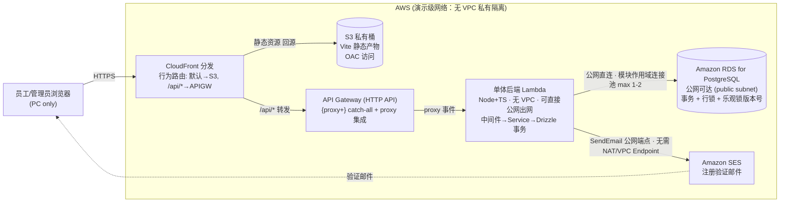
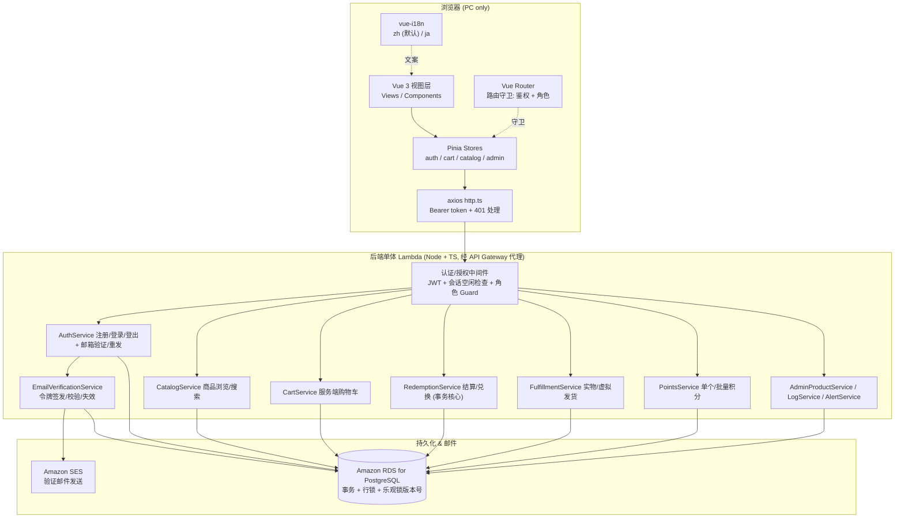
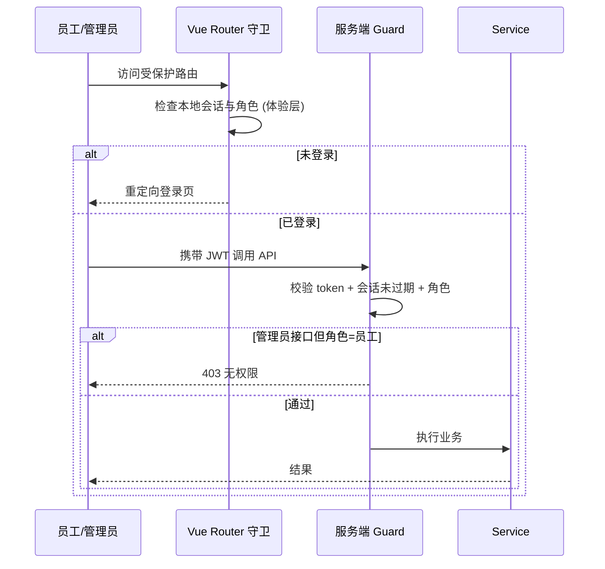
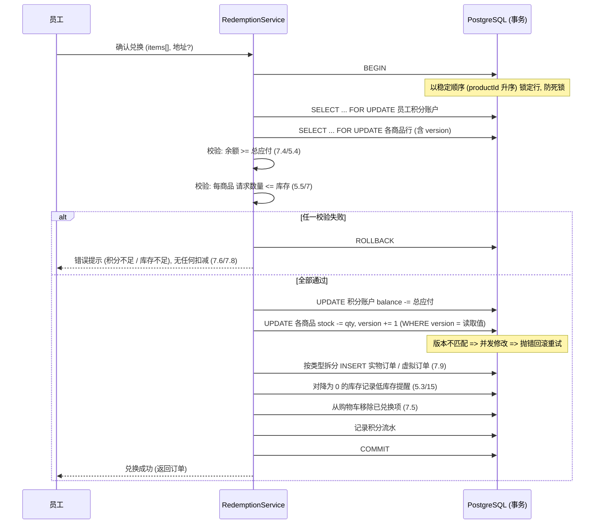
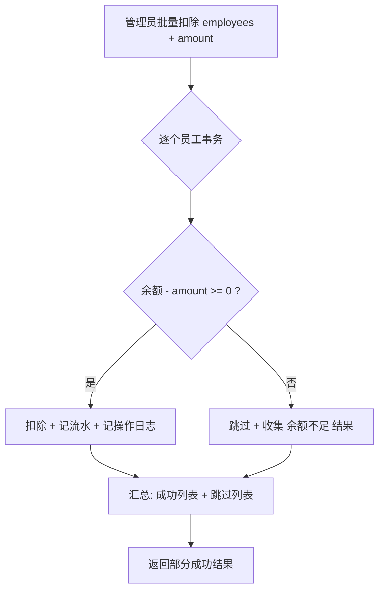
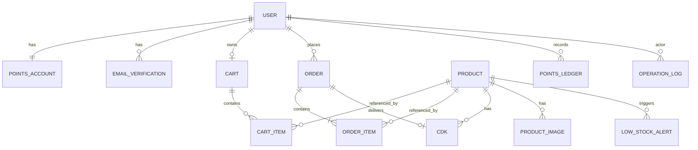
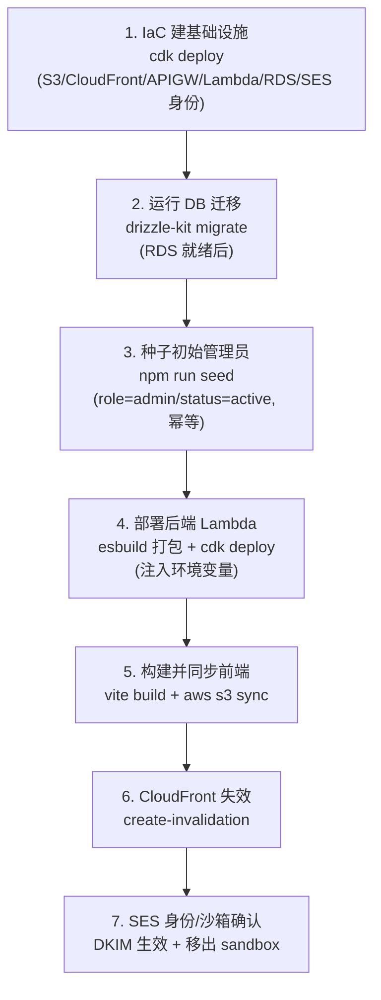

# Design Document

## Overview

AWSomeShop 是面向公司内部员工的福利积分兑换电商 MVP。本设计文档基于 `requirements.md` 中定义的需求（含图片上传与存储、个人资料与头像等，共 24 条需求），描述系统的整体架构、前后端组件、数据模型、正确性属性、错误处理与测试策略。

> **项目定位（演示/玩具项目）**：本项目本质上是**演示/玩具（demo）项目**，目标是**可演示 + 功能示意**，展示"员工积分兑换系统"完整业务流程，**不追求生产级别的性能、容量与压力承载能力**（需求 19），也**不追求生产级安全加固**（需求 20）。部署形态仍为真实 AWS 架构（CloudFront + S3 / API Gateway + Lambda / RDS PostgreSQL / SES），但在**性能、并发与安全强度**上按演示级取舍，并为演示便利采用**简化的网络隔离**（公网可达的 RDS、可直接出网的无 VPC Lambda）。本文档在相应章节以「演示取舍」显式标注这些取舍及其生产影响。

设计中仍需保证的一致性核心（不因 demo 定位而放弃）：

- 兑换结算时，积分扣除与库存扣减必须在**单次兑换事务内原子性**地整体成功或整体失败（需求 7.8、19.2）。
- 员工积分余额**永不为负**（需求 10.3、13.3）。
- 批量扣分时对余额将变负的员工**跳过**，其余员工正常执行（**部分成功**，需求 13.4）。

演示级取舍（不作为强 SLA 承诺）：

- 跨请求高并发兑换同一商品时的防超卖/防透支为**演示级尽力而为**（需求 7.10、19.4）：仍以行锁/乐观锁作为实现手段，但不承诺高并发规模下的强并发控制保证，也不做穷尽并发验证。

上述一致性核心属性天然适合属性化测试（Property-Based Testing, PBT），它们必须在**所有**输入组合下成立，因此本文档包含 `Correctness Properties` 章节。

### 技术选型总览

设计尽量沿用现有技术栈（Vue 3 + TypeScript + Vite + Pinia + Vue Router + axios）。后端需求（需求 19.3 要求通过后端 API 与数据库持久化）使用与前端一致的 TypeScript 生态，降低团队认知成本。

本次修订将部署目标定为 **AWS 无服务器/托管服务组合**，以贴合本项目「演示/玩具、轻量运维」的定位：前端静态资源经 CloudFront + S3 分发，后端以**单个单体 Lambda**（Node.js + TypeScript，**无 VPC 配置、可直接公网出网**）承载现有分层服务，数据落在**公网可达的 Amazon RDS for PostgreSQL**（Lambda 经公网/常规连接直连），注册验证邮件经 **Amazon SES** 发送。认证仍沿用自建 **JWT + 服务端会话** 方案（不使用 Cognito）。

> **演示取舍（网络简化）**：为演示便利，Lambda 不置于私有 VPC 子网、RDS 公网可达。此简化的直接收益是 Lambda 可直接访问 SES 与其它 AWS 公共端点、并直连 RDS，**无需 NAT Gateway 或 VPC Endpoint**，显著降低网络配置与成本复杂度。代价是 RDS 公网可达在生产中**不安全**，仅为 demo 便利；即便如此，建议至少用**安全组限制来源 IP + 强口令**作为 demo 级最低防护。生产环境应改回私有子网 + RDS 不公网暴露（见下文「生产演进方向」）。

| 层 | 选型 | 理由 |
|----|------|------|
| 前端框架 | Vue 3 (`<script setup>` + Composition API) + TypeScript | 现有项目已采用 |
| 前端构建 | Vite 6（`vite build` 产出静态资源） | 现有项目已采用；产物为纯静态文件，适合对象存储托管 |
| 前端托管 | **Amazon S3（私有桶）+ CloudFront（OAC）** | 低成本、免运维的静态站点分发；私有桶经 CloudFront OAC 访问，杜绝桶直连 |
| 前端状态 | Pinia | 现有依赖，用于会话、购物车、i18n 缓存 |
| 前端路由 | Vue Router 4 | 现有依赖，用于路由守卫做鉴权与角色控制 |
| HTTP 客户端 | axios（现有 `src/api/http.ts`） | 已配置拦截器与 401 处理 |
| 国际化 | vue-i18n | Vue 生态标准 i18n 方案（需求 17） |
| API 网关 | **Amazon API Gateway（HTTP API，`{proxy+}` catch-all + proxy 集成）** | 单一入口反向代理到 Lambda，保留后端自有路由体系 |
| 后端运行时 | Node.js + TypeScript（AWS Lambda） | 与前端同语言，共享类型定义；无服务器免运维 |
| 后端框架 | Express/NestJS + Lambda 适配器（`@codegenie/serverless-express` 或 `@fastify/aws-lambda`） | 保留现有分层服务与单事务兑换逻辑，几乎无需为「上 Lambda」改造业务代码 |
| ORM | **Drizzle ORM** | 纯 TS 实现、无 Rust 引擎二进制、冷启动更轻、包体积更小；事务与行锁（`SELECT ... FOR UPDATE`）为一等公民，契合单次兑换原子性设计；仍具类型安全与迁移工具 |
| 数据库驱动 | **postgres.js（`postgres`，porsager/postgres）** | 纯 JS PostgreSQL 驱动，供 Drizzle 使用；客户端在 handler 外模块作用域初始化并复用连接（每容器小连接池 `max = 1~2`） |
| 数据库 | **Amazon RDS for PostgreSQL（公网可达、Lambda 经公网直连；无 RDS Proxy / 无 Aurora Serverless）** | 支持事务与行/乐观锁，是满足单次兑换原子性的关键；公网可达为演示取舍（生产不安全），托管实例免自运维 |
| 邮件发送 | **Amazon SES** | 发送注册验证邮件（验证链接/验证码，24h 有效，需求 1）；无 VPC Lambda 可直连 SES 公网端点，无需 VPC Endpoint |
| 认证 | 自建 JWT（access token）+ 服务端会话空闲过期跟踪（**不使用 Cognito**） | 需求 1、2；会话空闲态存 RDS，Lambda 无状态亦可权威判定 |
| 网络 | **Lambda 无 VPC（默认，可直接公网出网）；RDS 公网可达（public subnet + publicly accessible）** | 演示取舍：免 NAT Gateway / VPC Endpoint，Lambda 直连 SES 与 RDS；生产应改回私有子网隔离 |
| 测试 | Vitest + fast-check（PBT）；Supertest（API 集成）；SES 以 mock/本地桩替身 | fast-check 为 TS 生态成熟 PBT 库 |
| 基础设施编排（IaC） | **AWS CDK（TypeScript）**（推荐）或 AWS SAM，二选一声明式管理 Lambda/API Gateway/RDS/S3/CloudFront/SES 身份 | 与现有 TS 生态认知一致；一次 `cdk deploy` 幂等编排全部资源，免手点控制台（详见「部署与自动化」章节） |
| 前端发布 | **AWS CLI**（`aws s3 sync` + `aws cloudfront create-invalidation`） | Vite 静态产物发布最轻量、可重复的少量命令方案（详见「部署与自动化」章节） |
| 数据库迁移 | **drizzle-kit**（`drizzle-kit generate` 从 TS schema 生成迁移 + 应用迁移；演示级可用 `drizzle-kit migrate` 或在部署脚本中执行迁移） | 对公网可达 RDS 声明式执行 schema 迁移，演示级可手动/一次性脚本触发 |

> 说明：后端框架 NestJS/Express 的具体取舍不影响本设计的核心一致性方案；关键在于所有涉及积分与库存的写操作都封装在数据库事务内并使用适当的并发控制。将其打包为单体 Lambda 后，事务边界与并发控制机制**完全不变**。

#### 单体 Lambda 与冷启动

后端打包为**单一** Lambda 函数，通过 Lambda 适配器把 API Gateway 的代理事件转换为框架可处理的 HTTP 请求，因此现有分层结构（中间件 → Service → Drizzle 事务）原样保留，兑换的单事务逻辑无需拆分。

冷启动权衡（演示项目可接受）：首个/扩容时的调用需初始化运行时、加载依赖并建立到 RDS 的连接，带来数百毫秒级延迟；后续「温」调用复用同一执行环境，开销可忽略。由于 **Lambda 不置于 VPC**，省去了弹性网卡（ENI）挂载环节，冷启动比 VPC 内 Lambda 更轻。缓解手段：保持依赖精简、构建时 tree-shaking/打包（如 esbuild）、把数据库连接放在 handler 外的模块作用域中复用（见下文数据库连接策略）。演示级并发下无需预置并发（Provisioned Concurrency）；若日后对 P99 延迟敏感可再评估，MVP 阶段不引入。

## Architecture

### AWS 部署架构

系统部署为「静态前端 + 单体 Lambda 后端 + 托管数据库 + 托管邮件」的组合。浏览器只与 CloudFront 交互：静态资源（SPA）回源到私有 S3，`/api/*` 经 CloudFront 转发到 API Gateway，再由 catch-all 代理集成打到唯一的后端 Lambda；**Lambda 无 VPC 配置、可直接公网出网**，经公网/常规连接直连**公网可达的 RDS**，并直连 **SES 公网端点**发送验证邮件。

> **演示取舍（无 VPC / 公网 RDS）**：图中不再有 VPC 私有子网边界。Lambda 直接出网访问 AWS 公共端点，因此**无需 NAT Gateway，也无需 VPC Endpoint**；RDS 标注为公网可达。此为 demo 便利取舍——生产环境应将 RDS 置于私有子网且不公网暴露、Lambda 置于 VPC 并经 VPC Endpoint/NAT 访问外部服务。



前端交付流水线（S3 + CloudFront）：
- `vite build` 产出静态资源上传到私有 S3 桶；CloudFront 通过 **OAC（Origin Access Control）** 读取，S3 桶策略仅允许该分发访问，不开放公网直连。
- **SPA 路由**：CloudFront 自定义错误响应把源返回的 `403/404` 映射为 `/index.html`（HTTP 200），交给 Vue Router 前端路由处理深链接刷新。
- **缓存与失效**：带内容指纹（hash）的静态资源长缓存（`immutable`），`index.html` 短缓存；每次发布对 `index.html`（必要时 `/*`）执行 CloudFront invalidation，保证新版本即时生效。

### 数据库连接策略（Lambda 公网直连 RDS）

演示项目为**演示级低并发**，连接管理只需一条务实策略，无需生产级的连接上限压测与硬约束论述：

- **模块作用域复用连接 + 每容器小连接池**：在 handler **外部**（模块作用域）初始化 **postgres.js 客户端**（`postgres(DATABASE_URL, { max: 1~2 })`）并交给 Drizzle（`drizzle(sql)`），使「温」调用复用同一执行环境的连接；单个执行环境池上限设为很小（postgres.js 的 `max = 1~2`），因为一个执行环境同一时刻只处理一个请求。
- 演示级并发下，并发执行环境数量有限，连接总数不会成为问题，无需为其设定硬上限或做连接耗尽压测。

> **生产演进方向**（附注，MVP 不实现）：若日后并发规模上升，可平滑引入 **RDS Proxy** 做连接复用/多路复用，并将 Lambda 与 RDS 重新纳入 **VPC 私有子网**做网络隔离（届时改经 VPC Endpoint/NAT 访问 SES），业务代码基本无需改动。

> 单次兑换的原子性仍完全依赖 **PostgreSQL 事务**（辅以行/乐观锁，见下文），与连接策略正交，不受公网直连方案影响。

### 系统分层



### 认证与会话流程（需求 1、2、20）

- 登录成功后服务端签发 JWT（含 `userId`、`role`），前端存入 `localStorage`（沿用现有 `http.ts` 的 `token` 约定），每次请求经拦截器带上 `Authorization: Bearer`。
- **会话空闲过期（60 分钟）在服务端权威判定**：服务端为每个会话在 **RDS 的 `Session` 表**中维护 `lastActiveAt`。每次受保护请求校验 `now - lastActiveAt <= 60min`；未过期则刷新 `lastActiveAt`，过期则返回 401 并要求重新登录。JWT 过期时间与该空闲窗口对齐，避免仅靠客户端计时（客户端计时不可信，需求 20.3）。
- **Lambda 无状态说明**：后端 Lambda 不保留任何内存会话态；会话空闲窗口的判定完全依赖 RDS 中的 `Session.lastActiveAt`。因此无论请求落到哪个执行环境、是否冷启动，会话有效性判定都是一致且权威的——空闲过期是「数据」而非「进程内存」，天然适配无服务器横向扩展。
- 前端 `http.ts` 已对 401 做统一处理（清除 token 并跳转登录页），与需求 2.4 一致。
- 路由守卫在客户端做第一道防线（未登录/非管理员重定向），服务端 Guard 做权威校验（需求 3.3、3.4、20.4）——**权限判断以服务端为准**，客户端守卫仅用于体验。
- **管理员账号来源（需求 3.5–3.7）**：系统**不提供管理员自助注册入口**；经由注册流程（需求 1）创建的账号角色一律为「员工」（由 Property 3 保证）。**首个（初始）管理员账号由部署初始化（种子数据）预置产生**，而非应用内注册或提权。MVP（演示）阶段亦**不提供将员工提升为管理员的应用内功能**；如需新增管理员，同样由部署阶段的一次性 seed 预置（seed 步骤见「部署与自动化 · 数据库种子」）。

### 注册与邮箱验证流程（需求 1，使用 SES）

注册后账号先进入「待验证」状态，只有完成邮箱验证（点击验证链接或提交验证码）后才变为「已激活」并允许登录（需求 1.3、1.12、1.13）。

```mermaid
sequenceDiagram
  participant E as 访客/员工
  participant A as AuthService
  participant V as EmailVerificationService
  participant DB as RDS (PostgreSQL)
  participant SES as Amazon SES
  E->>A: POST /auth/register (公司邮箱 + 密码)
  A->>A: 校验密码强度 / 邮箱域名 / 唯一性
  alt 校验失败
    A-->>E: 422/409 逐项错误
  else 校验通过
    A->>DB: 创建 User(status=待验证, role=employee)
    A->>V: 请求签发验证令牌
    V->>V: 生成不可猜测 token, 计算 tokenHash + expiresAt(now+24h)
    V->>DB: 保存 EmailVerification(tokenHash, expiresAt, consumedAt=null)
    V->>SES: SendEmail(验证链接/验证码)
    alt SES 发送失败
      Note over V,SES: 账号已创建为待验证; 记录发送失败, 不回滚账号
      V-->>E: 提示"注册成功, 但验证邮件发送失败, 请稍后重发"
    else 发送成功
      V-->>E: 提示"注册成功, 请查收验证邮件完成验证"
    end
  end

  E->>V: GET /auth/verify-email?token=... (或提交验证码)
  V->>DB: 按 tokenHash 查 EmailVerification
  alt 令牌不存在 / 已消费 / 已失效
    V-->>E: 400 验证失败
  else now > expiresAt
    V-->>E: 410 "验证链接/验证码已过期, 请重新发送"
  else 有效
    V->>DB: 事务内 置 consumedAt, 将 User.status=已激活
    V-->>E: 提示"验证成功, 可登录"
  end

  E->>V: POST /auth/resend-verification (待验证账号)
  V->>DB: 使该用户此前未消费令牌全部失效 (invalidatedAt)
  V->>DB: 新增 EmailVerification(新 token, 新 expiresAt)
  V->>SES: 重发验证邮件
  V-->>E: 提示"验证邮件已重发"
```

SES 集成与容错要点：
- **发送身份与合规**：使用经 SES 验证的发件身份（公司域名并配置 **DKIM**）。SES 账号从 **sandbox** 迁到 **production** 后方可向任意公司邮箱发送；sandbox 阶段只能发往已验证地址，仅用于开发联调。
- **令牌存储**：数据库只存**令牌哈希**（`tokenHash`）与 `expiresAt`，明文令牌只随邮件外发，降低库泄露风险。验证链接形如 `https://<cloudfront-domain>/verify?token=<原始 token>`（前端页面再调用 `verify-email` 接口），或直接使用验证码由用户输入。
- **失败不阻断账号创建**：SES 发送失败不得导致注册整体不可恢复地失败——账号已作为「待验证」持久化，用户可通过「重发验证邮件」重试；发送动作与账号创建解耦，避免把外部邮件服务的抖动变成注册事务失败。
- **重发使旧令牌失效**：每次重发都会把该用户此前未消费的验证令牌置为失效，只保留最新一枚有效（需求 1.11）。
- **过期处理**：验证时若 `now > expiresAt` 拒绝并提示重发（需求 1.10）。

### 角色与授权流程（需求 3、20）



### 安全模型（需求 20，演示级）

本项目为演示用途，保留**最基本**的鉴权与越权防护，但不做生产级安全加固：

- **鉴权与会话**：所有受保护数据/接口要求有效登录会话；未登录或会话过期一律拒绝（需求 20.1、20.3）。
- **管理员校验**：每一次后台管理操作在服务端权威校验请求者具备管理员权限（需求 20.4）；前端路由守卫仅用于体验。
- **管理员账号最小面（需求 3.5–3.7）**：不开放管理员注册与应用内提权，管理员仅由部署阶段的一次性种子（seed）预置，从源头收敛「谁能成为管理员」的攻击面（见「部署与自动化 · 数据库种子」）。
- **积分变更受控**：积分只能经受控的兑换流程或管理员操作变更，**服务端绝不接受客户端直接指定余额**（需求 20.2、Property 18）。
- **演示取舍（网络隔离简化）**：为演示便利，接受**简化的网络隔离**——RDS 公网可达、Lambda 无 VPC 直接出网（需求 20.5）。这在生产中不安全，仅为 demo；建议至少配置**安全组限制来源 IP + 数据库强口令**作为 demo 级最低防护，并使用 HTTPS（CloudFront/API Gateway 默认）。不做 WAF、私有子网、密钥轮转等生产级加固；生产化时应恢复私有网络隔离（见「生产演进方向」）。


兑换是系统中唯一需要跨"积分账户"与"多个商品库存"进行原子更新的操作。核心保证是**单次兑换事务的原子一致性**：采用**单个数据库事务**将积分扣除与所有库存扣减整体提交或整体回滚（需求 7.8、19.2）。行级锁（悲观）与乐观锁版本号作为**实现手段**用于在演示级并发下尽力避免超卖/透支，但**不作为高并发强 SLA 承诺**（需求 7.10、19.4，演示级尽力而为）：



并发控制说明（演示级尽力而为）：
- **单次事务原子性（强保证）**：一次兑换的积分扣除与库存扣减在同一事务内整体成功或整体失败，绝不产生部分扣减（需求 7.8、19.2）。这是本设计的强约束。使用 **Drizzle 的 `db.transaction(async (tx) => { ... })`** 封装整个兑换，事务内任一步抛错即整体回滚。
- **跨请求并发（演示级尽力）**：事务内先用 Drizzle 的 **`.for('update')`**（或 `sql` 模板发出 `SELECT ... FOR UPDATE`）按稳定顺序锁行，再用库存 `UPDATE ... WHERE id=? AND version=?`（Drizzle `sql` 表达式，影响行数为 0 视为并发修改则回滚并有限次重试）尽量避免超卖/透支；演示级低并发下足以工作良好，但**不承诺高并发规模下的强并发控制**，也不做穷尽并发验证（需求 7.10、19.4）。
- 库存与积分的 `UPDATE` 使用**相对更新**（`stock = stock - qty`），且约束 `stock >= 0`、`balance >= 0`（数据库 `CHECK` 约束，由 drizzle-kit 迁移/SQL 定义），构成最后一道防线（需求 10.3）。
- 锁的获取顺序固定（先积分账户、商品按 `productId` 升序），避免并发事务间死锁。

Drizzle 风格示意（行锁 + 版本条件更新，全程单事务）：

```ts
// RedemptionService.checkout 核心 (示意)
await db.transaction(async (tx) => {
  // 1) 稳定顺序锁行, 防死锁: 先积分账户, 再商品按 productId 升序
  const [account] = await tx
    .select()
    .from(pointsAccount)
    .where(eq(pointsAccount.userId, userId))
    .for('update')

  const rows = await tx
    .select()
    .from(product)
    .where(inArray(product.id, sortedProductIds)) // productId 升序
    .for('update')

  // 2) 校验: 余额 >= 应付总额; 每商品 请求数量 <= 库存 (失败则 throw -> 整体回滚)
  assertSufficient(account, rows, items)

  // 3) 条件扣减: 版本不匹配 (影响行数=0) 视为并发修改, 抛错回滚并有限次重试
  for (const it of items) {
    const res = await tx
      .update(product)
      .set({ stock: sql`${product.stock} - ${it.qty}`, version: sql`${product.version} + 1` })
      .where(and(eq(product.id, it.productId), eq(product.version, it.readVersion)))
    if (res.count === 0) throw new ConcurrencyConflictError()
  }

  // 4) 相对扣减积分 (余额 >= 0 由 CHECK 兜底), 生成订单/流水, 移除购物车已兑项
  await tx
    .update(pointsAccount)
    .set({ balance: sql`${pointsAccount.balance} - ${totalCost}`, version: sql`${pointsAccount.version} + 1` })
    .where(eq(pointsAccount.userId, userId))
  // ... INSERT 订单 / 记流水 / 消耗 CDK / 清购物车
})
```

### 批量积分部分成功流程（需求 13.4）



每位员工的扣除各自成组（单员工原子），批量层面允许部分成功；每位**实际执行**扣除的员工各记录一条操作日志（需求 13.4、13.6）。

### 文件存储与图片上传/下载（S3 + 预签名 URL）

本节描述员工头像与商品图片的上传、存储与查看设计（需求 22、23，及需求 4/12 关于商品图集/主图的增补）。核心取舍来自用户已确认的决策：

- **上传对象**：员工头像（可选，未设置用默认头像）+ 商品图片（多图/图集，含主图，单商品上限 5 张，演示级可调）。
- **格式与大小**：图片格式仅 JPG/PNG/WebP（`image/jpeg`、`image/png`、`image/webp`），单张 ≤ 5MB（需求 22.2、22.3）。
- **上传路径**：后端签发有时效的 S3 **预签名 PUT URL**，客户端直传 S3，**后端不中转文件内容**（需求 22.6、22.7）。
- **查看/下载路径**：图片经 **CloudFront 公开读**分发，视为非敏感内容、可公开缓存（需求 22.10）。

#### 存储桶设计

为**用户上传图片**使用一个**独立的 S3 桶**（`awsome-shop-uploads-<suffix>`），与承载 Vite 静态资源的前端桶（`awsome-shop-frontend-<suffix>`）**物理分离**。分离理由：两类内容的生命周期、缓存策略、CORS 与写入权限模型完全不同——前端桶由构建流水线整体覆盖发布、只读回源；上传桶由客户端经预签名 URL 持续写入、需 CORS 允许浏览器 PUT。混在一个桶会让权限与缓存策略互相牵制。

**CloudFront 分发选择（推荐）**：复用**现有的同一个 CloudFront 分发**，为上传内容新增一个 **behavior**（路径前缀如 `/media/*`）指向上传桶源，而非单独再建一个分发。理由：

- 演示项目单域名更简单，前端与图片同源可避免额外的 CORS/证书/域名管理；
- 一个分发的多 behavior 足以按路径前缀分流到不同源（`默认→前端桶`、`/api/*→API Gateway`、`/media/*→上传桶`）；
- 单独分发只有在需要独立缓存 TTL/WAF/域名隔离时才有必要，演示级无此需求。

上传桶经 CloudFront **公开读**分发（图片非敏感），但**桶本身仍建议用 OAC/受控写入**：对象读取只经 CloudFront（可缓存），直接对桶的写入仅限预签名 URL 授权的 PUT，Block Public Access 尽量保持开启、不开放桶级公共读。

#### 预签名上传流程

```mermaid
sequenceDiagram
  participant C as 客户端 (员工/管理员浏览器)
  participant API as 后端 Lambda (UploadService)
  participant S3 as S3 上传桶
  participant CF as CloudFront (公开读 /media/*)
  participant DB as RDS (PostgreSQL)

  C->>C: 前端即时校验 content-type ∈ {jpeg,png,webp} 且 size ≤ 5MB (体验层)
  C->>API: POST /uploads/presign { purpose, targetId, contentType, size }
  API->>API: 校验登录 + 权限 (商品图需管理员; 头像限本人)
  API->>API: 校验 contentType ∈ {jpeg,png,webp} 且 size ≤ 5MB (权威层)
  alt 校验失败
    API-->>C: 422 UNSUPPORTED_IMAGE_TYPE / IMAGE_TOO_LARGE
  else 校验通过
    API->>API: 生成 objectKey (avatars/{userId}/{uuid}.{ext} 或 products/{productId}/{uuid}.{ext})
    API->>S3: 用 AWS SDK 生成有时效(5min)预签名 PUT URL<br/>conditions: content-type 固定 + content-length-range ≤ 5MB
    API-->>C: { uploadUrl, objectKey, publicUrl }
  end
  C->>S3: HTTP PUT 直传图片内容 (Content-Type 必须匹配签名)
  Note over S3: S3 侧强制 content-type 与 content-length-range;<br/>不满足条件或 URL 过期则拒绝 (403)
  S3-->>C: 200 上传成功
  C->>API: 关联接口 (POST /me/avatar 或 POST /admin/products/:id/images) { objectKey }
  API->>DB: 将 objectKey/publicUrl 关联到实体 (头像→User; 商品图→ProductImage, 含主图/上限校验)
  API-->>C: 关联成功 (返回 publicUrl)
  C->>CF: GET publicUrl (经 CloudFront 公开读, 可缓存)
  CF-->>C: 图片内容
```

流程分三段：**签发（presign）→ 直传（PUT）→ 关联（confirm）**。后端只在签发与关联两步参与，图片字节流全程不经过后端（需求 22.7）。

#### 对象 key 命名约定

| 用途 | key 模式 | 示例 |
|------|----------|------|
| 员工头像 | `avatars/{userId}/{uuid}.{ext}` | `avatars/8f.../a1b2c3.webp` |
| 商品图片 | `products/{productId}/{uuid}.{ext}` | `products/2d.../f4e5d6.jpg` |

- `{uuid}` 保证同一实体多次/多张上传不碰撞；`{ext}` 由 content-type 映射（`image/jpeg→jpg`、`image/png→png`、`image/webp→webp`）。
- 以实体维度分目录，便于按用户/商品定位与（可选）批量清理。
- 公开访问 URL = `https://<cloudfront-domain>/media/<objectKey>`（`/media/*` behavior 指向上传桶）。

#### 校验策略（格式与大小双重把关）

格式与大小采用**前端即时校验 + S3 侧权威约束**的双重把关：

- **前端即时校验**（体验层）：选择文件后立即用 `File.type` 与 `File.size` 判断，超限/非法格式即时提示，避免无谓上传。
- **后端签发校验**：`/uploads/presign` 依据声明的 `contentType` 与 `size` 决定是否签发，非法即拒绝（需求 22.4、22.5）。
- **S3 侧权威约束**（防绕过关键）：预签名 URL 通过 **conditions** 约束 `Content-Type` 固定为声明值、`content-length-range` 上限为 5MB（`0 ≤ size ≤ 5*1024*1024`）。即使客户端绕过前端与后端声明、直接改用不同 content-type 或超大文件 PUT，**S3 也会拒绝**。这是防绕过的关键——前端校验只为体验，S3 conditions 才是权威约束（对齐需求 22.4/22.5 的强制性）。

> 说明：预签名 URL 依据**声明的**大小签发 conditions；真实字节数由 S3 依 `content-length-range` 强制。content-type 由签名固定，PUT 时头部不匹配即被 S3 拒绝。

#### 查看/下载

- 关联成功后，实体持有可经 CloudFront 访问的**公开 URL**（`https://<cloudfront-domain>/media/<objectKey>`）。
- 图片为**公开读、可缓存**内容（需求 22.10）：CloudFront 对 `/media/*` 可设较长缓存 TTL，读取无需鉴权。
- 员工端/管理端展示直接使用该 URL，无需再经后端签名读（本方案查看不走签名读）。

#### 商品图集与主图

- 一件商品可关联**多张图片**（图集），每张为一条 `ProductImage`，通过 `isPrimary` 标记主图、`sortOrder` 控制附图顺序（需求 4.5、12.7、12.8）。
- **单商品图片数上限 5 张**（演示级，可调，需求 22.11）：关联接口在插入前校验现有数量，超出则拒绝超出部分（需求 22.12）。
- **主图不变式**：同一商品**至多一张** `isPrimary=true`；当图集**非空**时**恰有一张**主图——若管理员未显式指定，系统自动将其中一张（如 `sortOrder` 最小者）设为主图（需求 12.9）。设定新主图时原主图自动降级为附图。
- 员工端列表展示主图（需求 4.1），详情展示完整图集（主图 + 附图，需求 4.5）；商品**未关联任何图片**时以占位图展示（需求 4.6）。

#### 默认头像

- 员工头像为**可选**，注册不要求（需求 23.1）。`User.avatarUrl` 为空表示未设置头像。
- 解析展示头像时：`avatarUrl` 非空则用之，为空则回退到统一的**默认头像 URL**（前端内置静态资源或约定的公开 URL，需求 23.2）。
- 成功更换头像后 `avatarUrl` 指向新图片，后续展示以新头像替换默认头像（需求 23.3、23.4）。

#### 演示级取舍与清理

- **删除实体时的 S3 清理**（演示级简化）：删除商品图 `ProductImage` 记录或更换头像时，**不强制**同步删除 S3 对象——演示级采用**惰性/不清理**策略，孤儿对象保留在上传桶（成本极低，演示流量下可忽略）。生产环境应在实体删除时同步删除对象，或用 S3 生命周期规则清理孤儿对象（附注，MVP 不实现）。
- **桶权限**：对象经 CloudFront **公开读**，但桶本身建议保持 **Block Public Access 开启 + OAC 读 + 预签名授权写**，不开放桶级公共读/公共写，降低误配置暴露面。
- 上传桶需配置 **CORS** 以允许浏览器从前端域名发起 `PUT` 直传（见「部署与自动化」章节）。

## Components and Interfaces

### 前端结构（在现有 `src/` 上扩展）

```
src/
  api/
    http.ts            // 现有 axios 实例
    auth.ts            // 注册/登录/登出/当前用户/验证邮箱/重发验证
    catalog.ts         // 商品列表/搜索/详情
    cart.ts            // 服务端购物车 CRUD
    redemption.ts      // 结算/立即兑换/订单历史
    admin.ts           // 商品管理/积分管理/发货/日志/低库存
  stores/
    auth.ts            // 会话/角色/token
    cart.ts            // 购物车镜像 + 合计
    catalog.ts         // 商品缓存与搜索状态
    i18n.ts            // 当前语言持久化
  router/
    index.ts           // 路由 + beforeEach 鉴权与角色守卫
  i18n/
    index.ts           // vue-i18n 配置
    locales/zh.ts      // 中文文案 (默认)
    locales/ja.ts      // 日文文案
  views/
    auth/LoginView.vue, RegisterView.vue, VerifyEmailView.vue (处理验证链接/验证码 + 重发)
    shop/CatalogView.vue, ProductDetailView.vue, CartView.vue, CheckoutView.vue
    account/PointsView.vue, HistoryView.vue, OrderDetailView.vue
    admin/AdminProductsView.vue, AdminPointsView.vue, AdminFulfillmentView.vue,
          AdminLogsView.vue, AdminDashboardView.vue (低库存提醒),
          AdminUsersView.vue (员工列表: 搜索/分页, 选择单个或多个员工发起积分操作)
  components/
    ProductCard.vue, ConfirmDialog.vue, AddressForm.vue, LanguageSwitcher.vue, ...
```

> **员工列表页与积分管理页的衔接（需求 24.5）**：`AdminUsersView.vue` 调用 `GET /admin/users?q=&page=` 展示员工列表（含余额），提供关键字搜索与分页，并支持行内多选。管理员在列表中勾选一个或多个员工后，将所选 `userId` 集合作为目标传递给积分管理流程——单选走 `AdminPointsView.vue` 的单个调整（`POST /admin/points/adjust`），多选走批量调整（`POST /admin/points/batch-adjust`，部分成功由 Property 20 保证）。员工列表页本身只读展示与选择，不直接写余额，实际积分变更仍由既有积分流程（需求 13）执行。

前端路由守卫（需求 1.15、2.4、3.1–3.3）：

```ts
// router/index.ts (示意)
router.beforeEach((to) => {
  const auth = useAuthStore()
  if (to.meta.requiresAuth && !auth.isAuthenticated) return { name: 'Login' }
  if (to.meta.requiresAdmin && auth.role !== 'admin') return { name: 'Catalog' } // 或 403 页
  return true
})
```

### 后端 API 契约

统一响应沿用现有 `ApiResponse<T>`（`{ code, message, data }`）与 `PaginatedData<T>`。所有 `/admin/*` 接口经管理员 Guard。所有非 `/auth/*` 接口经认证 + 会话空闲 Guard。

| 分组 | 方法 & 路径 | 说明 | 需求 |
|------|-------------|------|------|
| 认证 | `POST /auth/register` | 校验公司邮箱域名 + 密码强度，创建「待验证」员工账号，触发 SES 发送验证邮件 | 1.1–1.7 |
| 认证 | `GET /auth/verify-email?token=` | 校验验证令牌（存在/未消费/未过期），通过则将账号置「已激活」 | 1.9, 1.10 |
| 认证 | `POST /auth/resend-verification` | 对「待验证」账号重发验证邮件，并使旧令牌失效 | 1.11 |
| 认证 | `POST /auth/login` | 校验凭据；仅「已激活」账号可登录，建立 60min 空闲会话，返回 token+role | 1.12, 1.13, 1.14, 2.1 |
| 认证 | `POST /auth/logout` | 立即终止会话 | 2.5 |
| 认证 | `GET /auth/me` | 当前用户信息（刷新会话活跃时间） | 2.2 |
| 商品 | `GET /products` | 分页返回上架商品（含名称/图片/所需积分/库存状态） | 4.1, 4.2 |
| 商品 | `GET /products/search?q=` | 名称匹配的上架商品 | 4.3, 4.4 |
| 商品 | `GET /products/:id` | 商品详情（含类型） | 4.5 |
| 购物车 | `GET /cart` | 读取服务端购物车 | 6.5, 6.6 |
| 购物车 | `POST /cart/items` | 加入商品（校验上架+有货） | 6.1, 5.2 |
| 购物车 | `PATCH /cart/items/:productId` | 调整数量（校验不超库存） | 6.2, 6.3 |
| 购物车 | `DELETE /cart/items/:productId` | 移除条目 | 6.4 |
| 兑换 | `POST /redemptions/checkout` | 购物车结算（事务、可含地址） | 7.1, 7.3, 7.4, 7.8, 7.9 |
| 兑换 | `POST /redemptions/instant` | 立即兑换单件（事务） | 7.2, 7.4, 7.8 |
| 订单 | `GET /orders?page=` | 兑换历史（时间倒序、分页） | 11.1–11.4 |
| 订单 | `GET /orders/:id` | 订单详情（实物物流 / 虚拟 CDK 视状态展示） | 8.3, 9.3, 9.4 |
| 积分 | `GET /points/balance` | 当前余额 | 10.1–10.3 |
| 管理-商品 | `POST /admin/products` `PUT /admin/products/:id` | 创建/编辑商品，校验非负积分与库存 | 12.1–12.6 |
| 管理-商品 | `PATCH /admin/products/:id/status` | 上/下架 | 12.4, 4.2 |
| 管理-商品 | `POST /admin/products/:id/cdks` | 维护虚拟商品 CDK | 12.2, 5.1 |
| 管理-员工 | `GET /admin/users?q=&page=` | 分页返回员工列表（至少含 email、role、status、当前积分余额 balance），支持按邮箱/关键字搜索与空状态；供选择做单个/批量积分操作的目标 | 24.1–24.6 |
| 管理-积分 | `POST /admin/points/adjust` | 单个发放/扣除（校验不透支） | 13.1, 13.3, 13.5, 13.6 |
| 管理-积分 | `POST /admin/points/batch-adjust` | 批量发放/扣除（部分成功） | 13.2, 13.4, 13.6 |
| 管理-发货 | `POST /admin/orders/:id/ship-physical` | 上传物流编号（非空校验） | 14.1, 14.3, 8.2 |
| 管理-发货 | `POST /admin/orders/:id/ship-virtual` | 关联 CDK 虚拟发货 | 14.2, 9.4 |
| 管理-提醒 | `GET /admin/alerts/low-stock` | 低库存提醒列表 | 15.1, 15.2 |
| 管理-日志 | `GET /admin/logs?page=` | 操作日志（时间倒序） | 16.1, 16.2 |
| 上传 | `POST /uploads/presign` | 签发预签名 PUT URL（已登录）：入参 `purpose`(avatar\|product)、`targetId`、`contentType`、`size`；校验权限（商品图需管理员、头像限本人）与格式/大小意图后返回 `uploadUrl`+`objectKey`+`publicUrl` | 22.1–22.8 |
| 个人资料 | `POST /me/avatar` | 确认头像上传并将 `objectKey`/`publicUrl` 关联到当前登录员工（限本人） | 23.3, 23.4 |
| 管理-商品图 | `POST /admin/products/:id/images` | 关联已上传图片到该商品图集（校验 ≤5 张上限） | 12.7, 22.9, 22.11, 22.12 |
| 管理-商品图 | `PATCH /admin/products/:id/images/:imageId/primary` | 将指定图片设为主图（原主图降级为附图） | 12.8, 12.9 |
| 管理-商品图 | `DELETE /admin/products/:id/images/:imageId` | 从图集移除一张图片（演示级不强制删除 S3 对象） | 12.7 |

> **上传相关接口鉴权**：`POST /uploads/presign` 与 `/me/avatar` 要求有效登录会话；`purpose=product` 的预签名与全部 `/admin/products/:id/images*` 接口经**管理员 Guard**（需求 3.4、20.4）；`purpose=avatar` 的预签名与 `/me/avatar` **限本人**（`targetId` 必须等于当前登录 `userId`），员工不得为他人上传头像、不得越权关联商品图。

### 关键服务接口（后端，TypeScript 示意）

```ts
interface AuthService {
  register(email: string, password: string): Promise<{ userId: string; status: 'pending_verification' }>
  verifyEmail(token: string): Promise<{ status: 'active' }>
  resendVerification(email: string): Promise<void>   // 使旧令牌失效并重发
  login(email: string, password: string): Promise<{ token: string; role: Role }> // 仅 active 账号
}

interface EmailVerificationService {
  issue(userId: string): Promise<{ token: string; expiresAt: Date }>  // 生成令牌、存哈希、经 SES 发送
  validate(token: string, now: Date): Promise<{ userId: string } | { error: 'EXPIRED' | 'INVALID' }>
  invalidateExisting(userId: string): Promise<void>  // 重发前失效旧令牌
}

interface RedemptionService {
  // 结算/立即兑换共用核心，全程单事务
  checkout(userId: string, items: RedeemItem[], address?: Address): Promise<Order[]>
}

interface PointsService {
  adjust(adminId: string, userId: string, delta: number, reason?: string): Promise<PointsAccount>
  batchAdjust(adminId: string, userIds: string[], delta: number, reason?: string): Promise<BatchAdjustResult>
}

interface BatchAdjustResult {
  succeeded: Array<{ userId: string; newBalance: number }>
  skipped: Array<{ userId: string; reason: 'INSUFFICIENT_BALANCE' }>
}

interface AdminUserService {
  // 管理端员工列表: 关键字(按邮箱)过滤 + 分页, 每项返回 email/role/status 及当前积分余额 balance
  // q 为空表示浏览全部; 结果供积分发放/扣除流程选择目标 (需求 24.1, 24.2, 24.4, 24.5)
  listUsers(query: { q?: string; page: number; pageSize: number }): Promise<PaginatedData<AdminUserRow>>
}

interface AdminUserRow {
  userId: string
  email: string
  role: Role
  status: 'pending_verification' | 'active'
  balance: number   // 来自 PointsAccount.balance, 只读展示
}

type ImagePurpose = 'avatar' | 'product'
type AllowedImageType = 'image/jpeg' | 'image/png' | 'image/webp'

interface UploadService {
  // 校验登录/权限 + content-type/size 意图, 生成 objectKey 与有时效预签名 PUT URL
  presign(actor: AuthContext, req: {
    purpose: ImagePurpose; targetId: string; contentType: string; size: number
  }): Promise<{ uploadUrl: string; objectKey: string; publicUrl: string }
    | { error: 'UNSUPPORTED_IMAGE_TYPE' | 'IMAGE_TOO_LARGE' | 'FORBIDDEN' }>
}

interface AvatarService {
  // 将已上传对象关联为当前员工头像 (限本人); 返回新的 avatarUrl
  setAvatar(userId: string, objectKey: string): Promise<{ avatarUrl: string }>
  // 解析展示头像: 空 avatarUrl 回退默认头像
  resolveAvatarUrl(user: { avatarUrl: string | null }): string
}

interface ProductImageService {
  // 关联已上传图片到图集; 超过 5 张上限则拒绝 (IMAGE_LIMIT_EXCEEDED)
  addImage(productId: string, objectKey: string): Promise<ProductImage
    | { error: 'IMAGE_LIMIT_EXCEEDED' }>
  setPrimary(productId: string, imageId: string): Promise<void>  // 原主图降级为附图
  removeImage(productId: string, imageId: string): Promise<void>
  // 图集非空时恒返回恰一张主图 (未显式指定则自动选取)
  listImages(productId: string): Promise<{ primary: ProductImage | null; images: ProductImage[] }>
}
```

## Data Models

### 实体关系



### 字段定义

> 说明：下述各表的 `CHECK` 约束（如 `balance >= 0`、`stock >= 0`）、唯一索引与部分唯一索引均**由 drizzle-kit 迁移/SQL 定义**（从 TS schema `drizzle-kit generate` 生成迁移），与 ORM 选型无关。

**User（用户）**
| 字段 | 类型 | 约束 | 说明 |
|------|------|------|------|
| id | UUID | PK | |
| email | string | UNIQUE, 公司域名 | 需求 1.2, 1.5 |
| passwordHash | string | 非空 | 存储哈希，不存明文 |
| role | enum(`employee`,`admin`) | 默认 `employee` | 需求 1.4, 3 |
| status | enum(`pending_verification`,`active`) | 默认 `pending_verification` | 待验证/已激活；仅 `active` 可登录（需求 1.3, 1.12, 1.13） |
| avatarUrl | string? | 可空 | 头像公开 URL（经 CloudFront）；为空表示未设置头像，展示默认头像（需求 23.1, 23.2, 23.4） |
| createdAt | timestamp | | |

**EmailVerification（邮箱验证令牌，需求 1.4, 1.8–1.11）**
| 字段 | 类型 | 约束 | 说明 |
|------|------|------|------|
| id | UUID | PK | |
| userId | UUID | FK | 所属账号 |
| tokenHash | string | 非空、索引 | 仅存令牌哈希，明文只随邮件外发（需求 1.4） |
| expiresAt | timestamp | 非空 | = 签发时刻 + 24h（需求 1.8） |
| consumedAt | timestamp? | | 验证成功时置位；已消费令牌不可再用（需求 1.9） |
| invalidatedAt | timestamp? | | 重发时使旧令牌失效（需求 1.11） |
| createdAt | timestamp | | 签发时刻 |

> 有效令牌判定：`consumedAt IS NULL AND invalidatedAt IS NULL AND now <= expiresAt`。同一用户任意时刻至多一枚「有效」令牌——重发时先将该用户所有未消费令牌置 `invalidatedAt`，再插入新令牌。

**Session（会话）**（服务端权威空闲态，存于 RDS，支撑无状态 Lambda）
| 字段 | 类型 | 说明 |
|------|------|------|
| id | UUID | PK |
| userId | UUID | FK |
| lastActiveAt | timestamp | 空闲过期判定基准（需求 2.1–2.4）；每次受保护请求刷新 |
| expiresAt | timestamp | = lastActiveAt + 60min |
| revokedAt | timestamp? | 登出时置位（需求 2.5） |

**PointsAccount（积分账户）**
| 字段 | 类型 | 约束 | 说明 |
|------|------|------|------|
| userId | UUID | PK/FK | |
| balance | integer | `CHECK (balance >= 0)` | 永不为负（需求 10.3, 13.3） |
| version | integer | 乐观锁 | 演示级并发防透支实现手段（需求 7.10、19.4，尽力而为） |

**Product（商品）**
| 字段 | 类型 | 约束 | 说明 |
|------|------|------|------|
| id | UUID | PK | |
| name | string | 非空、可搜索 | 需求 4.3 |
| imageUrl | string? | 可空、主图冗余缓存 | 主图语义已迁移至 `ProductImage.isPrimary`（见下表）；此字段保留为**主图公开 URL 的冗余缓存**以便列表页免联表查询，随主图变更同步刷新，亦可移除改为实时查 `ProductImage`（演示级二者皆可，本设计保留为缓存） |
| description | text | | |
| pointsCost | integer | `CHECK (pointsCost >= 0)` | 需求 12.5 |
| type | enum(`physical`,`virtual`) | | 需求 12.1 |
| status | enum(`listed`,`unlisted`) | 默认 `unlisted` | 需求 4.1, 4.2, 12.4 |
| stock | integer | `CHECK (stock >= 0)`；虚拟商品为派生值 | 需求 5.1, 12.2 |
| version | integer | 乐观锁 | 演示级并发防超卖实现手段（需求 7.10、19.4，尽力而为） |

> 虚拟商品的 `stock` 语义上等于其**未使用 CDK 数量**（需求 5.1、12.2）。实现上以 `SELECT COUNT(*) FROM cdk WHERE productId=? AND status='available'` 作为可兑换库存的权威来源；`Product.stock` 字段对虚拟商品可作缓存并在 CDK 变更时同步。

> **商品不做物理删除（需求 12.10）**：本阶段**不提供商品删除接口/操作**，商品的下线（停止对员工展示与兑换）统一通过将 `status` 置为 `unlisted`（下架）实现——下架商品不出现在员工端列表与搜索（由 Property 8 保证），但记录仍保留在库，从而**保持与历史订单（`OrderItem.productId`）及商品图片（`ProductImage.productId`）的引用完整**，不产生悬挂外键。相应地，后端 API 契约中**不含 DELETE 商品接口**（仅有创建、编辑与上/下架状态切换）。

**ProductImage（商品图集，需求 4.5, 12.7–12.9, 22.9, 22.11, 22.12）**
| 字段 | 类型 | 约束 | 说明 |
|------|------|------|------|
| id | UUID | PK | |
| productId | UUID | FK | 所属商品 |
| objectKey | string | 非空 | S3 对象 key（`products/{productId}/{uuid}.{ext}`） |
| url | string | 非空 | 公开访问 URL（`https://<cloudfront-domain>/media/<objectKey>`，需求 22.10） |
| isPrimary | boolean | 默认 false | 主图标记；同一商品**至多一张** `true`（需求 12.8、12.9） |
| sortOrder | integer | 默认 0 | 附图展示顺序 |
| createdAt | timestamp | | |

> **图集不变式**（应用层 + 约束共同保证）：
> - 单商品图片数 **≤ 5**（需求 22.11）：关联接口在插入前 `COUNT` 校验，超出返回 `IMAGE_LIMIT_EXCEEDED`（需求 22.12）。
> - 同一商品**至多一张** `isPrimary=true`：可用部分唯一索引 `UNIQUE (productId) WHERE isPrimary = true`（由 drizzle-kit 迁移/SQL 定义）强制；设新主图时先将原主图置 false。
> - 图集**非空时恰有一张主图**：未显式指定主图时应用层自动将 `sortOrder` 最小者置为主图（需求 12.9）。
> - 商品无任何 `ProductImage` 时，列表/详情以占位图展示（需求 4.6）。

**CDK（虚拟兑换码）**
| 字段 | 类型 | 约束 | 说明 |
|------|------|------|------|
| id | UUID | PK | |
| productId | UUID | FK | |
| code | string | 加密/受控存储 | 待发货前不展示（需求 9.3） |
| status | enum(`available`,`consumed`,`delivered`) | | 消耗 1 个/次兑换（需求 9.2） |
| orderId | UUID? | FK | 关联到交付订单 |

**Cart / CartItem（服务端购物车，需求 6.6）**
| 字段 | 类型 | 说明 |
|------|------|------|
| Cart.id | UUID | PK |
| Cart.userId | UUID | UNIQUE FK |
| CartItem.cartId | UUID | FK |
| CartItem.productId | UUID | FK |
| CartItem.quantity | integer | `CHECK (quantity >= 1)` |

**Order / OrderItem（兑换订单，需求 7、8、9、11）**
| 字段 | 类型 | 说明 |
|------|------|------|
| Order.id | UUID | PK |
| Order.userId | UUID | FK |
| Order.type | enum(`physical`,`virtual`) | 按类型拆分（需求 7.9） |
| Order.pointsSpent | integer | 该订单消耗积分 |
| Order.status | enum(`pending_shipment`,`shipped`) | 待发货/已发货（需求 8.4, 9.3, 9.4, 14） |
| Order.shippingAddress | json? | 实物订单保存地址（需求 8.1） |
| Order.trackingNo | string? | 物流编号（需求 8.2, 14.1） |
| Order.createdAt | timestamp | 历史排序键（需求 11.2） |
| OrderItem.orderId | UUID | FK |
| OrderItem.productId | UUID | FK |
| OrderItem.productName | string | 下单时快照（历史稳定展示） |
| OrderItem.quantity | integer | |
| OrderItem.unitPoints | integer | 下单时快照单价 |

**PointsLedger（积分流水，需求 13.6, 20.2）**
| 字段 | 类型 | 说明 |
|------|------|------|
| id | UUID | PK |
| userId | UUID | FK |
| delta | integer | 正=发放/退回，负=兑换或扣除 |
| reason | enum(`redemption`,`admin_grant`,`admin_deduct`) + note? | 需求 13.5 |
| balanceAfter | integer | 审计用 |
| createdAt | timestamp | |

**OperationLog（操作日志，需求 16）**
| 字段 | 类型 | 说明 |
|------|------|------|
| id | UUID | PK |
| actorId | UUID | 操作人（需求 16.1） |
| action | enum(`product_create`,`product_update`,`product_status`,`points_grant`,`points_deduct`,`ship_physical`,`ship_virtual`) | 操作类型 |
| targetType / targetId | string / UUID | 操作对象 |
| createdAt | timestamp | 时间倒序展示（需求 16.2） |

**LowStockAlert（低库存提醒，需求 5.3, 15）**
| 字段 | 类型 | 说明 |
|------|------|------|
| id | UUID | PK |
| productId | UUID | UNIQUE（去重，避免重复触发，需求 15.1） |
| triggeredAt | timestamp | 库存降为 0 时生成 |
| resolvedAt | timestamp? | 补货/下架后清除 |

## Correctness Properties

*A property is a characteristic or behavior that should hold true across all valid executions of a system—essentially, a formal statement about what the system should do. Properties serve as the bridge between human-readable specifications and machine-verifiable correctness guarantees.*

以下属性由验收标准经 prework 分析归并去冗后得出。凡描述纯 UI 观感、平台兼容性、性能容量、架构约束的验收标准不在此列（改用示例/集成/冒烟/负载测试，见 Testing Strategy）。作为**演示级取舍**，跨请求高并发的防超卖/防透支不作为强约束属性做穷尽并发验证；Property 16 聚焦于**单次兑换事务的原子一致性**（可在内存模型 + 数据库集成两个层面稳定验证）。

### Property 1: 密码强度校验

*For any* 字符串 s, `validatePassword(s)` 返回通过当且仅当 s 长度 ≥ 8 且同时至少包含一个字母与一个数字。

**Validates: Requirements 1.1**

### Property 2: 公司邮箱域名校验

*For any* 邮箱字符串, 注册域名校验通过当且仅当其域名部分属于允许的公司邮箱域名集合。

**Validates: Requirements 1.2, 1.7**

### Property 3: 注册创建待验证员工账号且拒绝重复邮箱

*For any* 使用公司域名且满足密码强度的注册输入, 若该邮箱尚未注册, 则成功创建且新账号角色为 `employee`、账号状态为 `pending_verification`（待验证）; 若该邮箱已存在, 则注册被拒绝且用户集合不变。

**Validates: Requirements 1.4, 1.5**

### Property 4: 登录失败提示不可区分

*For any* 登录失败输入（无论邮箱不存在还是密码错误）, 系统返回的错误信息完全一致, 不泄露具体失败原因。

**Validates: Requirements 1.14**

### Property 5: 会话有效性不变式

*For any* 会话与任意当前时间 `now`, `isSessionValid(session, now)` 为真当且仅当该会话未被登出且 `now - lastActiveAt ≤ 60min`; 有效访问会刷新 `lastActiveAt`。

**Validates: Requirements 2.1, 2.2, 2.3, 2.5**

### Property 6: 未登录访问受保护资源被拒

*For any* 受保护接口/路由, 不携带有效会话的访问一律被拒绝（重定向或 401）。

**Validates: Requirements 1.15, 20.1, 20.3**

### Property 7: 基于角色的授权矩阵

*For any* （角色, 接口）组合, 管理端接口仅在角色为 `admin` 时放行, 员工端接口对已登录用户放行; 员工访问任一管理端接口一律被拒。

**Validates: Requirements 3.1, 3.2, 3.3, 3.4, 20.4**

### Property 8: 员工端列表与搜索仅含上架商品

*For any* 商品集合与任意搜索关键字（含空关键字表示浏览）, 返回结果恰为「状态为上架 且（无关键字或名称匹配关键字）」的商品子集, 绝不包含下架商品。

**Validates: Requirements 4.1, 4.2, 4.3, 12.4**

### Property 9: 商品展示字段完整

*For any* 商品, 列表项至少含名称、图片、所需积分与库存/可兑换状态; 详情至少含名称、图片、描述、所需积分、库存状态与类型（实物/虚拟）。

**Validates: Requirements 4.1, 4.5**

### Property 10: 虚拟商品可兑换库存等于可用 CDK 数

*For any* 虚拟商品与其 CDK 集合, 其可兑换库存等于状态为 `available` 的 CDK 数量; 当该数量为 0 时该商品视为「已兑完」。

**Validates: Requirements 5.1, 12.2**

### Property 11: 零库存商品不可加购或兑换

*For any* 库存为 0 的商品, 加入购物车与立即兑换均被拒绝。

**Validates: Requirements 5.2**

### Property 12: 购物车总额不变式与持久化往返

*For any* 购物车状态（经任意加入、改量、移除操作序列后）, 应付积分总额恒等于 Σ(单价 × 数量), 且每项小计 = 单价 × 数量; 将购物车写入服务端后于新会话读取应得到完全一致的内容。

**Validates: Requirements 6.1, 6.2, 6.4, 6.5, 6.6, 7.1**

### Property 13: 兑换前置校验阻止非法兑换且不产生副作用

*For any* 兑换请求, 若可用积分 < 应付总额, 或任一商品请求数量 > 其当前库存, 或含实物商品但未填写配送地址, 则兑换被拒绝, 且积分余额、所有商品库存、CDK 状态、订单集合均保持不变。

**Validates: Requirements 5.4, 5.5, 6.3, 7.3**

### Property 14: 兑换原子性（整体成功或整体失败）

*For any* 含一个或多个商品的兑换, 结果只有两种：要么全部生效（余额恰减少应付总额、每个商品库存恰减少对应数量、虚拟商品消耗对应数量 CDK、生成订单、来自购物车的已兑项被移除、积分流水被记录）, 要么全无变化（任何一处校验失败或异常时, 余额、所有库存、CDK 状态、订单集合与操作前完全一致, 不产生部分扣减）。

**Validates: Requirements 7.4, 7.5, 7.6, 7.8, 9.2**

### Property 15: 混合兑换按类型拆分且积分守恒

*For any* 同时包含实物与虚拟商品的兑换, 恰生成一个实物订单与一个虚拟订单, 每个订单项按其商品类型正确归类, 且两订单消耗积分之和等于本次兑换应付总额。

**Validates: Requirements 7.9**

### Property 16: 单次兑换事务的原子一致性（演示级）

*For any* 含一个或多个商品的单次兑换，事务提交后应满足：账户扣分总额恰等于应付总额、每个商品库存恰减少对应数量、且最终库存 ≥ 0、余额 ≥ 0；事务回滚时上述各项与操作前完全一致（不产生部分扣减）。

> **演示级说明**：本属性验证**单次兑换事务内**的原子一致性。跨请求高并发下的防超卖/防透支为演示级尽力而为（需求 7.10、19.4），不作为强约束属性做穷尽并发验证（仅在集成测试以 1~3 个代表性并发场景做示意）。

**Validates: Requirements 7.8, 19.2**

### Property 17: 积分余额始终非负

*For any* 由兑换与管理员发放/扣除组成的任意操作序列, 每个员工的积分余额在每一步之后都 ≥ 0。

**Validates: Requirements 10.3, 13.3**

### Property 18: 积分变更仅经受控流程且余额=流水累积

*For any* 员工, 其当前余额恒等于初始余额加上其全部积分流水 delta 之和; 不存在任何可由客户端直接设定余额的通道。

**Validates: Requirements 10.2, 20.2**

### Property 19: 单个积分调整精确改变余额

*For any* 员工与调整量 delta, 若调整后余额 ≥ 0, 则调整后余额恰等于原余额 + delta。

**Validates: Requirements 13.1, 13.2**

### Property 20: 批量扣分部分成功分区与日志计数

*For any* 员工集合与扣除量, 批量扣除后 `succeeded` 恰为「扣除后余额 ≥ 0」的员工且其余额各减少该扣除量, `skipped` 恰为「扣除后余额将 < 0」的员工且其余额不变; `succeeded` 与 `skipped` 构成对输入集合的划分（不重不漏）, 且新增操作日志条数等于实际执行扣除的员工数。

**Validates: Requirements 13.4, 13.6**

### Property 21: 实物订单地址往返与发货状态转换

*For any* 含实物商品的兑换, 订单持久保存所填配送地址且读取一致; 未发货时状态为「待发货」, 上传非空物流编号后状态变为「已发货」并记录该编号。

**Validates: Requirements 8.1, 8.2, 8.4, 14.1**

### Property 22: 空物流编号被拒绝

*For any* 实物订单, 若提交的物流编号为空或纯空白, 则发货被拒绝且订单保持「待发货」。

**Validates: Requirements 14.3**

### Property 23: 虚拟发货前隐藏 CDK、发货后展示并置已发货

*For any* 虚拟订单, 在完成虚拟发货前其展示不含 CDK 且状态为「待发货」; 完成虚拟发货后状态变为「已发货」并展示已关联的 CDK。

**Validates: Requirements 9.3, 9.4, 14.2**

### Property 24: 纯虚拟兑换不要求地址

*For any* 仅包含虚拟商品的兑换, 无需填写配送地址即可成功。

**Validates: Requirements 9.1**

### Property 25: 低库存提醒在库存降为 0 时唯一触发（去重）

*For any* 使某商品库存降为 0 的兑换序列, 该商品当前有且仅有一条未解决的低库存提醒, 不因重复降为 0 而产生重复提醒。

**Validates: Requirements 5.3, 15.1**

### Property 26: 兑换历史字段完整、时间倒序与分页完整

*For any* 员工的订单集合, 历史列表每项至少含商品名称、消耗积分、兑换时间与状态, 结果按兑换时间从新到旧排序; 且对任意分页参数, 各页记录拼接后恰等于全集（无重复、无遗漏）, 每页大小不超过页容量。

**Validates: Requirements 11.1, 11.2, 11.3**

### Property 27: 操作日志完整性与时间倒序

*For any* 受审计操作（商品增改/上下架、积分发放/扣除、实物/虚拟发货）, 系统恰生成一条含操作人、操作类型、操作对象与操作时间的日志; 日志列表按时间从新到旧排序。

**Validates: Requirements 16.1, 16.2, 14.4**

### Property 28: 商品创建/编辑往返一致

*For any* 合法商品输入, 创建或编辑保存后读取应得到与输入一致的字段, 并对员工端后续浏览生效。

**Validates: Requirements 12.1, 12.3**

### Property 29: 非法商品数值被拒绝

*For any* 商品输入, 若所需积分或库存为负数或非法值, 则保存被拒绝且不产生/修改商品。

**Validates: Requirements 12.5**

### Property 30: i18n 文案键完整对齐且切换取对应语言

*For any* 面向用户的文案键, 中文与日文文案集合的键完全一致且均无空值; 切换语言后, 每个键渲染出所选语言对应的文案。

**Validates: Requirements 17.2, 17.3**

### Property 31: 邮箱验证令牌生命周期与激活闸门

*For any* 账号与其验证令牌集合：令牌签发时其 `expiresAt` 恒等于签发时刻 + 24 小时，且数据库仅保存令牌哈希（不保存明文）；账号状态只能通过一枚「有效」令牌（未消费、未失效且 `now ≤ expiresAt`）的验证由「待验证」转为「已激活」，使用已过期、已消费或已失效的令牌验证一律被拒绝且账号状态保持「待验证」；一次成功验证后该令牌被标记为已消费而不可再次使用。

**Validates: Requirements 1.4, 1.8, 1.9, 1.10**

### Property 32: 重发使旧令牌失效且仅存一枚有效令牌

*For any* 处于「待验证」状态的账号与其任意数量的既有未消费令牌, 执行「重发验证邮件」后：此前所有未消费令牌均失效（用其验证会被拒绝）, 且该账号在任一时刻至多存在一枚可用于验证的有效令牌（即最新签发的那枚）。

**Validates: Requirements 1.11**

### Property 33: 登录准入仅当账号已激活

*For any* 账号与正确的邮箱/密码组合, 登录被允许当且仅当该账号状态为「已激活」; 当账号状态为「待验证」时登录被拒绝并返回「邮箱尚未验证」提示（区别于凭据错误的通用提示）。

**Validates: Requirements 1.3, 1.12, 1.13**

### Property 34: 图片上传校验——签发当且仅当格式与大小合法

*For any* 图片上传预签名请求（任意 `contentType` 与 `size`），系统签发预签名 URL **当且仅当** `contentType ∈ {image/jpeg, image/png, image/webp}` 且 `0 < size ≤ 5MB`；否则拒绝签发——格式非法时返回 `UNSUPPORTED_IMAGE_TYPE`、超过 5MB 时返回 `IMAGE_TOO_LARGE`。

**Validates: Requirements 22.2, 22.3, 22.4, 22.5**

### Property 35: 商品图集不变式（数量上限与主图唯一性）

*For any* 商品与任意图集操作序列（添加、设主图、删除的任意组合），操作后恒满足：该商品关联图片数 ≤ 5（尝试超出上限的添加被拒绝并返回 `IMAGE_LIMIT_EXCEEDED`，其余图片不变）；`isPrimary=true` 的图片至多一张；当图集非空时恰有一张主图（未显式指定主图时系统自动选取一张），图集为空时无主图。

**Validates: Requirements 22.9, 22.11, 22.12, 12.8, 12.9**

### Property 36: 头像回退与更换

*For any* 员工，其展示头像在 `avatarUrl` 为空（未设置）时解析为统一的默认头像 URL；在成功设置/更换头像后解析为所设置图片的 URL。

**Validates: Requirements 23.2, 23.4**

### Property 37: 员工列表搜索与分页完整性

*For any* 员工集合、任意搜索关键字（含空关键字表示浏览）与任意分页参数：过滤结果恰为「邮箱包含该关键字」的员工子集（不多含、不遗漏），且每一项均含邮箱、角色、账号状态与当前积分余额四项字段；对该过滤结果按任意分页参数取出的各页记录，拼接后恰等于过滤全集（无重复、无遗漏），且每页记录数不超过页容量。

> 本属性与 Property 8（商品搜索）、Property 26（历史分页）同型，但作用于**员工**实体并将「关键字过滤」与「分页拼接完整」两个维度合并为一条综合属性，提供独立验证价值，故单列而非并入。授权约束（员工不得访问 `/admin/users`）由 Property 7 覆盖，此处不重复。

**Validates: Requirements 24.1, 24.2, 24.4**

## Error Handling

### 错误响应约定

沿用现有 `ApiResponse<T>` 结构，错误以非零 `code` + 可本地化 `message` 返回。前端根据 `code` 映射到 i18n 文案（需求 17），保证中日双语错误提示完整。

| 场景 | HTTP | code 分类 | 前端处理 | 需求 |
|------|------|-----------|----------|------|
| 未认证 / 会话过期 | 401 | `UNAUTHENTICATED` | `http.ts` 清 token 并跳登录页 | 1.15, 2.4, 20.1, 20.3 |
| 无管理员权限 | 403 | `FORBIDDEN` | 提示无权限 / 跳转 | 3.3, 20.4 |
| 注册校验失败 | 422 | `VALIDATION`（逐项 field errors） | 表单逐项高亮 | 1.6, 1.7 |
| 邮箱已注册 | 409 | `EMAIL_TAKEN` | 表单提示 | 1.5 |
| 验证令牌已过期 | 410 | `VERIFICATION_EXPIRED` | 提示「已过期，请重发验证邮件」并显示重发入口 | 1.10 |
| 验证令牌无效/已消费/已失效 | 400 | `VERIFICATION_INVALID` | 提示验证失败并显示重发入口 | 1.9, 1.11 |
| 账号未验证却尝试登录 | 403 | `EMAIL_NOT_VERIFIED` | 提示「邮箱尚未验证，请先完成邮箱验证」并显示重发入口 | 1.13 |
| 验证邮件发送失败（账号已创建为待验证） | 202 | 结果体含 `emailSendFailed=true` | 提示「注册成功但邮件发送失败，请稍后重发」，不回滚账号 | 1.4, 1.11 |
| 积分不足 | 409 | `INSUFFICIENT_POINTS` | 兑换弹窗提示 | 5.4, 7.4 |
| 库存不足 / 超卖冲突 | 409 | `INSUFFICIENT_STOCK` | 提示并刷新库存 | 5.5, 6.3, 7.10 |
| 并发版本冲突 | 409 | `CONCURRENCY_CONFLICT` | 后端有限重试; 耗尽则提示重试（演示级尽力而为） | 7.10, 19.4 |
| 缺少配送地址 | 422 | `ADDRESS_REQUIRED` | 结算前拦截 | 7.3 |
| 空物流编号 | 422 | `TRACKING_REQUIRED` | 管理端表单提示 | 14.3 |
| 批量扣分部分失败 | 200 | 结果体含 `skipped[]` | 展示成功/跳过明细 | 13.4 |
| 非法商品数值 | 422 | `INVALID_PRODUCT_FIELD` | 表单提示 | 12.5 |
| 图片格式不支持 | 422 | `UNSUPPORTED_IMAGE_TYPE` | 提示「仅支持 JPG、PNG、WebP 格式的图片」，拒绝签发 | 22.4 |
| 图片超过 5MB | 422 | `IMAGE_TOO_LARGE` | 提示「单张图片大小不得超过 5MB」，拒绝签发 | 22.5 |
| 预签名 URL 过期 / 直传失败 | 403 | `UPLOAD_URL_EXPIRED`（由 S3 侧拒绝，前端捕获） | 提示重新发起上传（重新签发） | 22.8 |
| 商品图集超过数量上限 | 409 | `IMAGE_LIMIT_EXCEEDED` | 提示「已达到每件商品的图片数量上限（5 张）」，拒绝超出部分 | 22.11, 22.12 |

### 事务与并发错误策略

- 兑换事务遇 `CHECK` 约束违反（`balance/stock < 0`）或乐观锁版本不匹配时，整事务 `ROLLBACK`，对外表现为 `INSUFFICIENT_STOCK` / `INSUFFICIENT_POINTS` / `CONCURRENCY_CONFLICT`，绝不落地部分变更（保证 Property 14、16 的单次兑换原子性）。
- 版本冲突采用**有限次自动重试**（如最多 3 次，带抖动）；重试仍失败则返回 `CONCURRENCY_CONFLICT` 让用户重试。此为演示级尽力而为的并发处理（需求 7.10、19.4），非高并发强 SLA。
- 批量积分操作中单个员工的失败被捕获并归入 `skipped[]`，不影响其余员工（保证 Property 20）。

### 邮箱验证与 SES 错误策略

- **发送失败不回滚账号**：注册事务只负责创建「待验证」账号与签发令牌记录；SES 发送作为事务提交后的动作。发送失败时返回 `202` + `emailSendFailed=true`，账号保留为「待验证」，引导用户「重发验证邮件」，避免外部邮件服务抖动导致注册整体失败（需求 1.4）。
- **过期与无效令牌**：验证接口对 `now > expiresAt` 返回 `VERIFICATION_EXPIRED`（410），对不存在/已消费/已失效令牌返回 `VERIFICATION_INVALID`（400），两者均不改变账号状态（保证 Property 31）。
- **重发的失效原子性**：重发在单事务内先将该用户全部未消费令牌置 `invalidatedAt`，再插入新令牌，保证任一时刻至多一枚有效令牌（保证 Property 32）。
- **未验证登录**：`active` 之外的账号即便凭据正确也返回 `EMAIL_NOT_VERIFIED`（403），与凭据错误的通用提示区分（保证 Property 33、需求 1.13、1.14）。

### 图片上传错误策略

- **签发前双重意图校验**：`/uploads/presign` 依声明的 `contentType`/`size` 校验，非法直接拒绝（`UNSUPPORTED_IMAGE_TYPE` / `IMAGE_TOO_LARGE`，需求 22.4、22.5），不签发 URL（保证 Property 34）。
- **S3 侧权威约束防绕过**：即便绕过前后端校验，预签名 URL 的 conditions（`Content-Type` 固定 + `content-length-range ≤ 5MB`）也会让 S3 拒绝不合规 PUT；过期 URL 由 S3 返回 403，前端捕获后引导重新签发（需求 22.8）。
- **图集上限**：关联接口插入前 `COUNT` 校验，超过 5 张返回 `IMAGE_LIMIT_EXCEEDED`（409），拒绝超出部分而不影响已有图片（保证 Property 35、需求 22.12）。
- **关联失败与孤儿对象**：直传成功但关联接口失败时，对象已在 S3 但未挂到实体，形成孤儿对象；演示级采用惰性/不清理策略（见「文件存储与图片上传/下载」演示取舍），前端可提示用户重试关联。

### 前端错误边界

- axios 响应拦截器统一处理 401（已实现）；其余错误由各 Pinia action 捕获并转为可展示的本地化消息。
- 视图层对空态（无搜索结果、无历史记录）展示友好空状态（需求 4.4、11.4）。

## Testing Strategy

采用**属性化测试 + 单元测试 + 集成测试**互补的分层策略。

### 属性化测试（Property-Based Testing）

- **库**：`fast-check`（与 Vitest 集成），不自建 PBT 框架。
- **迭代次数**：每个属性测试至少运行 **100** 次随机迭代（`fc.assert(prop, { numRuns: 100 })`）。
- **标签**：每个属性测试以注释标注来源，格式：`// Feature: awsome-shop, Property {number}: {property_text}`。
- **一对一**：上述每条 Correctness Property 由**单个**属性测试实现。
- **单次兑换原子性属性（Property 16）建模**：以「操作序列 + 线性化」的模型化测试验证纯逻辑层的单次兑换原子一致性不变式（内存 reducer 模型：整体成功或整体回滚、库存/余额非负）。**演示级取舍**：跨请求高并发的防超卖/防透支不作强约束穷尽验证，仅在集成测试以 1~3 个代表性并发场景做示意（需求 7.10、19.4）。
- **邮箱验证属性（Property 31–33）**：以 mock SES（注入的发送替身）在纯逻辑层验证令牌生命周期与激活闸门——生成器覆盖有效/过期/已消费/已失效令牌、`now` 落在 `expiresAt` 前后边界、任意数量的既有令牌用于重发失效场景，以及 `active`/`pending_verification` 两种账号状态下的登录准入。断言只涉及本系统逻辑，SES 仅验证「是否被调用一次」，不做真实网络发送。
- **图片上传/图集/头像属性（Property 34–36）**：在纯逻辑层验证，不触达真实 S3。
  - Property 34：生成器覆盖合法 content-type（`image/jpeg`/`png`/`webp`，含大小写变体）与非法 content-type（如 `image/gif`、`application/pdf`、伪造/空 MIME），以及 size 边界（`0`、`1`、`5MB`、`5MB+1`、超大值）；断言签发决策与「合法性」严格等价，拒绝分支返回对应错误码（`UNSUPPORTED_IMAGE_TYPE`/`IMAGE_TOO_LARGE`）。预签名 URL 生成用注入的 S3 SDK 替身。
  - Property 35：生成 0..6 张添加、随机 `setPrimary`/`removeImage` 的操作序列作用于图集模型；断言任意序列后「图片数 ≤ 5、超限添加被拒（`IMAGE_LIMIT_EXCEEDED`）、`isPrimary=true` 至多一张、非空图集恰一张主图（含未显式指定时自动选主图）、空图集无主图」。
  - Property 36：生成 `avatarUrl ∈ {null, 纯空白, 合法 URL}`；断言 `resolveAvatarUrl` 在空/未设置时返回默认头像 URL、设置后返回所设 URL。
- **员工列表搜索与分页属性（Property 37）**：在纯逻辑层验证 `AdminUserService.listUsers` 的过滤与分页。生成器覆盖随机员工集合（含相同/不同邮箱、大小写、Unicode）、随机关键字（含空关键字、无匹配关键字）与随机分页参数（页码、页容量含边界 1 与超出总数）；断言过滤结果恰为邮箱匹配子集、每项含 email/role/status/balance、各页拼接恰等于过滤全集（不重不漏）、每页大小 ≤ 页容量。不触达真实数据库（以内存模型或注入的查询替身验证纯逻辑）。
- **生成器覆盖边界**：邮箱生成器覆盖公司/非公司域名、大小写、非法格式；密码生成器覆盖长度与字符类边界；商品生成器覆盖实物/虚拟、上/下架、零库存；金额/库存生成器覆盖 0、负数与大值；验证令牌生成器覆盖有效/过期/已消费/已失效及边界时间；Unicode 文案覆盖中日文与特殊字符。

### 单元测试

聚焦具体示例、缺省行为与不易属性化的点：
- 登录成功跳转、二次确认弹窗（7.1、7.2）、成功兑换不可取消（7.7）、可选备注（13.5）、实物不强制 CDK（12.6）。
- 空状态展示（4.4、11.4）、默认语言中文（17.1）、低库存提醒后台展示（15.2）、已发货实物订单展示物流（8.3）。
- 员工列表空状态提示「未找到相关员工」（24.3）、在员工列表选中单个/多个员工后转入积分调整流程（24.5，配合集成验证 batch-adjust）。
- 注册成功提示需完成验证、验证成功提示可登录、重发提示、SES 发送失败时的提示文案（1.4、1.9、1.11）。
- 边界/错误条件：非法注册输入逐项报错（1.6）、过期会话 401（2.4）、下架不可兑（12.4）、未验证登录的专属提示区别于凭据错误（1.13、1.14）。

### 集成测试（Supertest + 真实 PostgreSQL，经 Drizzle 执行）

不适合 PBT 的基础设施/持久化验证（数据库读写统一经 **Drizzle + postgres.js** 对真实 PostgreSQL 执行）：
- 数据变更经后端 API 落库（19.3）：写入后重启读取仍存在。
- 端到端兑换事务在真实数据库上的**单次原子性**（7.8、19.2）：用 Drizzle 的 `db.transaction` + 行锁/版本条件更新验证整体成功或整体回滚；跨请求并发一致性为演示级尽力而为，仅以 1~3 个代表性并发场景做示意（7.10、19.4），不做高并发压测。
- 权限 Guard 在真实路由上的拦截（3、20.4）。
- **注册→验证→登录**端到端链路（1.4、1.9、1.12、1.13）：真实数据库上完成「注册（mock SES）→取库中令牌→验证→登录成功」与「未验证登录被拒」两条路径。

### 基础设施与 SES 集成/冒烟测试

- **SES 发送（真实）**：在受控环境用一个 SES 已验证的收件地址跑 1~2 个冒烟用例，确认验证邮件可实际投递、链接可点击；日常 CI 中 SES 一律 mock，避免真实发信与配额消耗（需求 1.4）。
- **SES 身份/DKIM 与 sandbox→production**：作为一次性冒烟/配置核对（发件域名验证、DKIM 生效、账号已脱离 sandbox），非属性化。
- **前端托管（S3 + CloudFront）**：部署后冒烟核对——静态资源经 CloudFront 可访问、深链接刷新经 403/404→`index.html` 回退正常、发布后 invalidation 生效取到新版本。
- **Lambda 公网直连 RDS**：部署后冒烟核对——无 VPC 的 Lambda 能经公网直连公网可达的 RDS 完成一次读写、并能直连 SES 端点发信（验证「免 NAT/VPC Endpoint」的网络路径可用）；演示级低并发下无需连接耗尽压测。
- **初始管理员种子（需求 3.6）**：迁移后执行 seed 脚本的冒烟/集成核对——校验库中存在**恰一个** `role=admin`、`status=active` 的种子账号，且其 `passwordHash` 非空（库中不含明文口令），可用注入的 `SEED_ADMIN_EMAIL`/`SEED_ADMIN_PASSWORD` 完成一次管理员登录；重复执行 seed 应幂等（不产生重复管理员）。
- **图片直传与公开读（真实链路冒烟）**：
  - **预签名直传 S3**：签发一个短时效预签名 PUT URL，客户端 PUT 一张合法图片成功（后端不经手字节流），并核对超时后（过期）PUT 返回 403（需求 22.6–22.8）。
  - **CloudFront 公开读**：经 CloudFront 的 `/media/<objectKey>` 公开 GET 上传后的图片返回 200 且可缓存（需求 22.10）。
  - **上传桶 CORS**：核对浏览器从前端域名发起的跨域 `PUT` 预检/直传被允许（配置正确）。
  - 上述均为 1~3 个代表性示例的集成/冒烟用例，不做属性化、不做压测。

### 非 PBT 覆盖说明

- 平台兼容性（18.1、18.2）与界面风格（21.1）：手工 / E2E 冒烟评审，不做属性化。
- 性能与容量（19.1）：负载 / 压力测试，不做属性化。

### 覆盖矩阵摘要

| 需求 | 主要验证方式 |
|------|--------------|
| 1, 2, 3, 20（认证/会话/授权） | Property 1–7, 31–33 + 单元(1.6,2.4,1.13) + 集成(Guard, 注册→验证→登录) |
| 1（邮箱验证/SES） | Property 31–33 + 单元(1.4,1.9,1.11) + SES 冒烟(真实发信) |
| 4, 5, 12（商品/库存/管理） | Property 8–11, 25, 28, 29 + 单元(4.4,12.4,12.6) |
| 6, 7, 9, 19.2（购物车/兑换/单次原子性） | Property 12–17, 24 + 集成(单次原子性 + 演示级并发示意) + 单元(7.1,7.2,7.7) |
| 8, 14（发货） | Property 21–23, 27 + 单元(8.3) |
| 10, 11, 13, 16（余额/历史/积分/日志） | Property 17–20, 26, 27 + 单元(13.5) |
| 15（低库存提醒） | Property 25 + 单元(15.2) |
| 17（i18n） | Property 30 + 单元(17.1) |
| 22, 23（图片上传/头像/商品图集） | Property 34–36 + 单元(23.1,23.3) + 集成/冒烟(预签名直传 S3、CloudFront 公开读、上传桶 CORS) |
| 24（员工列表查看） | Property 37(搜索+分页完整性) + Property 7(24.6 授权) + 单元(24.3 空状态, 24.5 选中转积分流程) + 集成(选中多员工→batch-adjust) |
| 3.5–3.7（管理员账号来源/无提权） | Property 3(注册产出 employee) + Property 7(员工无法访问管理端) + 契约审阅(无注册/提权接口) + seed 冒烟(存在唯一 admin 种子账号) |
| 12.10（商品不物理删除） | Property 8(下架不展示) + 契约审阅(无 DELETE 商品接口) + 数据模型(下线=unlisted, 引用完整) |
| 部署/基础设施（S3+CloudFront / API GW+Lambda 无VPC / RDS 公网直连 / SES / 上传桶 / seed 初始管理员） | 冒烟 / 配置核对 / 网络路径冒烟 |
| 18, 19.1, 21（平台/性能/风格） | 冒烟 / 负载 / 人工评审 |

## 部署与自动化（Deployment & Automation）

本章描述如何用 **AWS CLI** 与 **IaC 工具**把本项目一键/少量命令地部署到真实 AWS 环境。目标与项目「演示/玩具」定位一致：**声明式、可重复执行、免手点控制台**，不追求企业级多环境流水线（无多账号、多区域蓝绿/金丝雀、审批门禁等）。所有取舍延续前文「演示取舍」口径——单账号、单区域、演示级安全与网络隔离。

### 工具选型与理由

部署面拆成两类，采用「IaC 管资源 + CLI 发前端」的务实组合：

| 用途 | 工具 | 理由 |
|------|------|------|
| 基础设施编排（Lambda、API Gateway、RDS、S3、CloudFront、SES 身份） | **AWS CDK（TypeScript，推荐）** 或 AWS SAM | 声明式、幂等、可版本化；一条 `cdk deploy` / `sam deploy` 拉起并更新全部资源 |
| 前端静态资源发布（S3 上传 + CloudFront 失效） | **AWS CLI**（`aws s3 sync`、`aws cloudfront create-invalidation`） | Vite 产物是纯静态文件，用两条 CLI 命令即可完成发布，无需为其单独建 IaC 逻辑 |
| 数据库 schema 迁移 | **drizzle-kit**（`drizzle-kit generate` + 应用迁移，或 `drizzle-kit migrate`） | 迁移文件由 `drizzle-kit generate` 从 TS schema 生成，声明式，演示级可手动或用一次性脚本触发 |
| SES 发件身份/DKIM 引导 | IaC 定义身份 + AWS CLI 核对 / 一次性引导 | 身份与 DKIM 可由 IaC 声明；sandbox→production 需人工申请，用 CLI 核对状态 |

**IaC 二选一推荐与权衡：**

- **推荐 AWS CDK（TypeScript）**：本项目前后端均为 TypeScript，用 CDK/TS 编写基础设施可与现有代码库共享语言、类型与工具链（`tsc`、包管理），团队认知一致、无需引入新 DSL；CDK 对「S3+CloudFront+OAC、HTTP API + Lambda 代理、RDS、SES 身份」这类混合资源有成熟的高层构造（L2/L3 constructs），编排表达力强。
- **备选 AWS SAM**：若只想要「Lambda + API Gateway」这条最轻量路径，SAM 模板（YAML）更简洁、`sam local` 便于本地联调 Lambda；但对 CloudFront/S3/RDS 这类非纯 serverless 资源需要回落到内嵌 CloudFormation，表达不如 CDK 顺手。
- **结论**：本设计以 **CDK（TypeScript）** 为主线示例；若团队更偏好 YAML 且可接受少量内嵌 CloudFormation，可平替为 SAM，部署命令由 `cdk deploy` 换成 `sam build && sam deploy` 即可，**部署顺序与其余自动化步骤不变**。

> **为何这套组合适合演示项目**：声明式 IaC 让「基础设施 = 代码」，任何人 clone 仓库后用同一条命令即可重建整套演示环境；幂等特性支持反复部署而不产生漂移；前端用 CLI 两条命令发布，学习与维护成本极低；演示结束后一条 `cdk destroy` 即可清理，避免持续计费。全程免手点控制台，契合「可演示 + 可重复」目标。

### 基础设施编排（IaC）

用一套 IaC（CDK stack，或等价 SAM/CloudFormation 模板）声明以下资源，`cdk deploy` 一次编排完成：

- **S3 桶（前端静态托管）**：私有桶（Block Public Access 全开），仅经 CloudFront **OAC（Origin Access Control）** 读取；桶策略只允许该 CloudFront 分发访问，杜绝公网直连。
- **S3 桶（用户上传图片）**：**独立于前端桶**的上传桶（`awsome-shop-uploads-<suffix>`），承载头像与商品图片；Block Public Access 保持开启，读经 CloudFront 公开分发、写仅经预签名 URL 授权的 PUT（不开桶级公共读/写）。需配置 **CORS**：允许 `PUT`（及必要的 `GET`）来自 CloudFront 前端域名（`AllowedOrigins: https://<cloudfront-domain>`）、`AllowedHeaders: *`、暴露 `ETag`，使浏览器可直传（需求 22.6、22.7）。
- **CloudFront 分发**：
  - 默认行为回源到前端 S3（OAC）。
  - **SPA 深链接回退**：自定义错误响应把源返回的 `403`/`404` 映射为 `/index.html` 且响应码 `200`，交给 Vue Router 处理刷新/深链接（对齐前文「SPA 路由」）。
  - **`/api/*` 行为**：额外 behavior 将 `/api/*` 指向 API Gateway 源（转发到后端）。
  - **`/media/*` 行为（图片公开读）**：额外 behavior 将 `/media/*` 指向**上传桶**源（经 OAC 读取），公开读、可设较长缓存 TTL（图片非敏感、可缓存，需求 22.10）。**推荐复用同一分发**新增此 behavior，而非单独建分发（理由见「文件存储与图片上传/下载 · 存储桶设计」）。
- **API Gateway（HTTP API）**：`$default`/`{proxy+}` catch-all + 到单体 Lambda 的 proxy 集成，保留后端自有路由体系。
- **单体 Lambda（Node.js + TypeScript）**：**无 VPC 配置**（可直接公网出网）；通过环境变量注入运行期配置（DB 连接串、JWT 密钥、SES 发件地址、公司邮箱域名白名单、上传桶名/CloudFront 媒体域名等，见「后端部署自动化」）。IAM 执行角色需具备对**上传桶**的 **`s3:PutObject`** 权限（用于生成预签名 PUT URL——签名所授予的权限即角色自身的 `PutObject`），限定资源到该桶的 `avatars/*` 与 `products/*` 前缀；本方案图片查看走 CloudFront 公开读，Lambda **无需** `s3:GetObject`（如日后改为签名读再按需追加）。
- **RDS for PostgreSQL**：**公网可达**（public subnet + `publiclyAccessible`），**安全组仅放行受限来源 IP**（演示机器/办公网出口 IP）与数据库端口；配合数据库强口令作为 demo 级最低防护。
- **SES 发件身份**：声明发件域名/邮箱身份与 **DKIM**（见「SES 一次性引导」）。

> 这些资源以**一次** `cdk deploy`（或 `sam deploy`）完成编排与后续更新；资源间引用（如 CloudFront 引用 S3/API GW、Lambda 引用 RDS 端点与安全组）由 IaC 自动解析输出，避免手工填写。栈输出（Outputs）暴露 `BucketName`、`DistributionId`、`ApiEndpoint`、`RdsEndpoint` 等，供后续 CLI 步骤与迁移脚本消费。

### 前端部署自动化（AWS CLI）

前端为 Vite 静态产物，用 AWS CLI 两步发布（Windows cmd 友好）：

```cmd
:: 1) 构建静态产物到 dist/
npm run build

:: 2) 同步到 S3 私有桶（--delete 清理已删除的旧文件）
aws s3 sync dist/ s3://awsome-shop-frontend-<suffix> --delete

:: 3) 使 CloudFront 缓存失效，确保新版本即时生效
aws cloudfront create-invalidation --distribution-id <DISTRIBUTION_ID> --paths "/index.html" "/*"
```

缓存策略说明：

- 带内容指纹（hash）的资源（如 `assets/index-a1b2c3.js`）可长缓存（`immutable`），文件名变化即天然「换新」，无需失效。
- `index.html` 为短缓存入口文件，每次发布对其（必要时对 `/*`）执行 invalidation，保证用户立即取到指向新 hash 资源的最新 `index.html`（对齐前文「缓存与失效」）。

### 后端部署自动化

后端为单体 Lambda（TypeScript），部署流程：

```cmd
:: 1) 用 esbuild 打包后端为单一 bundle（tree-shaking、精简依赖，降低冷启动）
npm run build:backend   :: 内部调用 esbuild 产出 dist-lambda/index.js

:: 2) 用 IaC 部署/更新 Lambda 与 API Gateway
cdk deploy               :: 或 SAM: sam build && sam deploy
```

> **打包说明**：Drizzle ORM 与 postgres.js 均为**纯 JS/TS**、无 Rust 引擎二进制，esbuild 打包产物更小、无需处理引擎 `binaryTarget` 或按 Lambda 运行时匹配原生二进制，冷启动更轻。

**环境变量注入**（由 IaC 在 Lambda 定义中声明，`cdk deploy` 时下发）：

| 环境变量 | 用途 | 来源 |
|----------|------|------|
| `DATABASE_URL` | postgres.js 连接公网可达 RDS 的连接串（供 Drizzle 使用） | 栈输出的 RDS 端点 + 口令（见「配置管理」） |
| `JWT_SECRET` | 签发/校验 JWT 的密钥 | SSM Parameter Store（SecureString）或 Lambda 环境变量 |
| `SES_FROM_ADDRESS` | 验证邮件发件地址 | 已验证的 SES 发件身份 |
| `COMPANY_EMAIL_DOMAINS` | 允许注册的公司邮箱域名白名单 | 部署配置 |
| `SESSION_IDLE_MINUTES` | 会话空闲过期分钟数（默认 60） | 部署配置 |
| `UPLOAD_BUCKET` | 用户上传图片的 S3 桶名（生成预签名 URL 用） | 栈输出的上传桶名 |
| `MEDIA_BASE_URL` | 图片公开访问基址（`https://<cloudfront-domain>/media`） | CloudFront 分发域名 |
| `MAX_IMAGE_BYTES` | 单张图片大小上限（默认 5MB） | 部署配置 |
| `MAX_PRODUCT_IMAGES` | 单商品图片数上限（默认 5，演示级可调） | 部署配置 |
| `SEED_ADMIN_EMAIL` | 初始管理员种子账号邮箱（仅 seed 脚本消费，一次性） | 部署配置 / SSM |
| `SEED_ADMIN_PASSWORD` | 初始管理员种子账号初始口令（仅 seed 脚本消费，一次性，脚本内哈希后入库、不落明文） | SSM Parameter Store（SecureString），一次性 |

> 演示阶段密钥类值（`JWT_SECRET`、DB 口令）建议存 **SSM Parameter Store（SecureString）**，由 IaC 引用注入，不写死在仓库；简化起见亦可直接用 Lambda 环境变量（见「演示级取舍与配置管理」）。

### 数据库迁移自动化

使用 **drizzle-kit** 对公网可达 RDS 执行 schema 迁移。迁移文件由 `drizzle-kit generate` 从 TS schema 生成并提交到仓库，部署时应用：

```cmd
:: 以指向 RDS 的 DATABASE_URL 应用已生成的迁移（非交互，适合脚本/CI）
set DATABASE_URL=postgresql://app:<password>@<rds-endpoint>:5432/awsomeshop
npx drizzle-kit migrate
```

- **执行时机**：在**基础设施就绪后（RDS 端点可用）、后端 Lambda 上线前**执行，确保新代码所依赖的表结构已存在。
- **演示级方式**：可由开发者从受限来源 IP 的机器**手动执行**，或作为**一次性脚本 / CI step**在部署流水中调用（因 RDS 公网可达 + 安全组放行来源 IP，迁移可从本地直连执行，无需堡垒机）。
- 迁移文件由 `drizzle-kit generate` 从 TS schema 生成；`drizzle-kit migrate` 只应用尚未应用的迁移、不生成新迁移，幂等且非交互，适合反复运行。

### 数据库种子（预置初始管理员，需求 3.5–3.7）

由于系统**不提供管理员自助注册与应用内提权**，**首个（初始）管理员账号必须在部署阶段由一次性 seed 脚本预置**。seed 在 **DB 迁移完成之后、后端 Lambda 上线之前**执行，确保表结构就绪且首个管理员在服务对外前已存在。

seed 脚本（**自写的一次性 seed 脚本**，如 `npm run seed` 调用一个用 **Drizzle + postgres.js** 写入管理员的 TS 脚本）动作：

- 读取环境变量 `SEED_ADMIN_EMAIL` 与 `SEED_ADMIN_PASSWORD`（**一次性**注入，见「配置管理」），**不将凭据硬编码进仓库或库中明文**——脚本内对口令做与登录一致的哈希，仅将 `passwordHash` 落库。
- 插入（或幂等 upsert）一个 `role=admin`、`status=active` 的 `User`，并为其创建对应 `PointsAccount(balance=0)`。
- **幂等**：以 `SEED_ADMIN_EMAIL` 为唯一键 upsert（Drizzle 的 `insert(...).onConflictDoNothing()` 或按 email 唯一约束 upsert），重复执行不产生重复管理员；若同邮箱账号已存在则跳过创建（不覆盖既有口令），保证反复部署安全。

```cmd
:: 在迁移完成后、后端上线前执行一次性种子（DATABASE_URL 指向 RDS）
set DATABASE_URL=postgresql://app:<password>@<rds-endpoint>:5432/awsomeshop
set SEED_ADMIN_EMAIL=admin@example-company.com
set SEED_ADMIN_PASSWORD=<一次性初始口令>
npm run seed
```

> **演示级取舍与安全**：`SEED_ADMIN_PASSWORD` 建议存 **SSM Parameter Store（SecureString）** 一次性注入，用后即可从环境清除；库中只有 `passwordHash`。初始管理员登录后应尽快更改口令（口令修改属常规账户能力，不属于「提权」）。此步骤为**一次性引导**——首次部署执行一次即可，后续各轮部署因幂等而无副作用，可保留在脚本中或跳过。

### SES 一次性引导

发验证邮件前需完成一次性 SES 引导：

```cmd
:: 核对发件身份验证状态与 DKIM 是否生效
aws ses get-identity-verification-attributes --identities example-company.com
aws ses get-identity-dkim-attributes --identities example-company.com

:: （首次）请求验证发件域名 / 地址（亦可由 IaC 声明身份）
aws ses verify-domain-identity --domain example-company.com
```

- 发件域名/地址需完成验证并使 **DKIM** 生效（身份可由 IaC 声明，域名 DNS 记录需在域名服务商处配置）。
- **申请移出 sandbox**：SES 新账号默认处于 **sandbox**，只能向**已验证地址**发信且有**每日 200 封**、每秒发送速率上限；向全体演示用户（任意公司邮箱）发信前，必须在控制台/工单申请移出 sandbox 进入 production。此为「注册验证邮件面向全体演示用户」的**前置步骤**，需在正式演示前预留审批时间。
- 日常 CI 中 SES 一律 mock（见 Testing Strategy），仅在受控环境跑 1~2 个真实发信冒烟用例。

### 部署顺序与一键脚本

端到端部署遵循下列顺序（存在依赖关系，需按序执行）：



> 说明：步骤 1 与 4 都可由 `cdk deploy` 完成——首轮 `cdk deploy` 已包含 Lambda 定义，步骤 4 的「后端更新」是在代码/环境变量变化后**再次** `cdk deploy`。步骤 3（种子初始管理员）在迁移后、后端上线前执行，幂等且仅首次实际插入（见「数据库种子」）。步骤 7 的「移出 sandbox」为一次性审批，通常只在首次演示前做一次，之后各轮部署可跳过。

**少量命令部署（一键脚本）**：把上述命令串进一个脚本或 npm script，实现「少量命令部署」。

Windows 批处理 `deploy.cmd`（示意）：

```cmd
@echo off
setlocal
echo [1/6] 部署基础设施...
call cdk deploy --require-approval never || goto :err

echo [2/6] 执行数据库迁移...
call npx drizzle-kit migrate || goto :err

echo [3/6] 种子初始管理员（幂等）...
call npm run seed || goto :err

echo [4/6] 重新部署后端 Lambda（代码/环境变量更新）...
call npm run build:backend && call cdk deploy --require-approval never || goto :err

echo [5/6] 构建并同步前端到 S3...
call npm run build && call aws s3 sync dist/ s3://%FRONTEND_BUCKET% --delete || goto :err

echo [6/6] 使 CloudFront 缓存失效...
call aws cloudfront create-invalidation --distribution-id %DISTRIBUTION_ID% --paths "/index.html" "/*" || goto :err

echo 部署完成。首次演示前请确认 SES 已移出 sandbox 且 DKIM 生效。
goto :eof
:err
echo 部署失败，请检查上一步输出。
exit /b 1
```

亦可在 `package.json` 中登记 `"deploy": "..."` script，用 `npm run deploy` 触发（bash 环境可提供等价 `deploy.sh`）。`FRONTEND_BUCKET`、`DISTRIBUTION_ID` 等取自 IaC 栈输出。

### 演示级取舍与配置管理

延续前文「演示取舍」口径，部署面同样做演示级简化：

- **单账号 / 单区域**：所有资源部署在同一 AWS 账号与同一区域，不做多环境（dev/stage/prod）分离与跨区容灾。
- **凭据/密钥简化**：DB 口令与 `JWT_SECRET` 用 **SSM Parameter Store（SecureString）** 存储并由 IaC 引用注入；演示可进一步简化为直接用 **Lambda 环境变量**。**不做密钥自动轮转、不接 Secrets Manager 轮转**——这是有意的演示取舍，生产环境应启用托管轮转与更严格的最小权限。
- **网络与安全**：RDS 公网可达 + 安全组限制来源 IP + 强口令（对齐前文安全模型）；不做 WAF、私有子网、VPC Endpoint。
- **teardown（演示后清理）**：一条命令销毁整套环境，避免持续计费：

  ```cmd
  cdk destroy        :: 或 SAM: sam delete
  ```

  > **持续计费提示**：本架构中 **RDS 实例是主要的持续计费项**（按小时计费，即使空闲）；S3/CloudFront/Lambda/API Gateway/SES 多为按量计费，演示流量下成本很低。演示结束务必 `cdk destroy` 或至少停止/删除 RDS 实例，以免 RDS 持续产生费用。销毁前如需保留演示数据，可先对 RDS 打快照。
