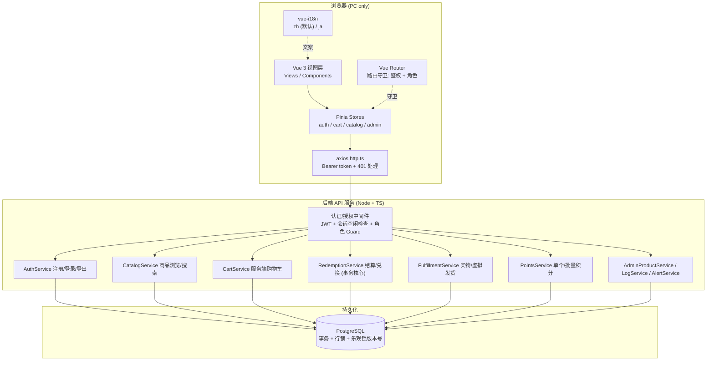
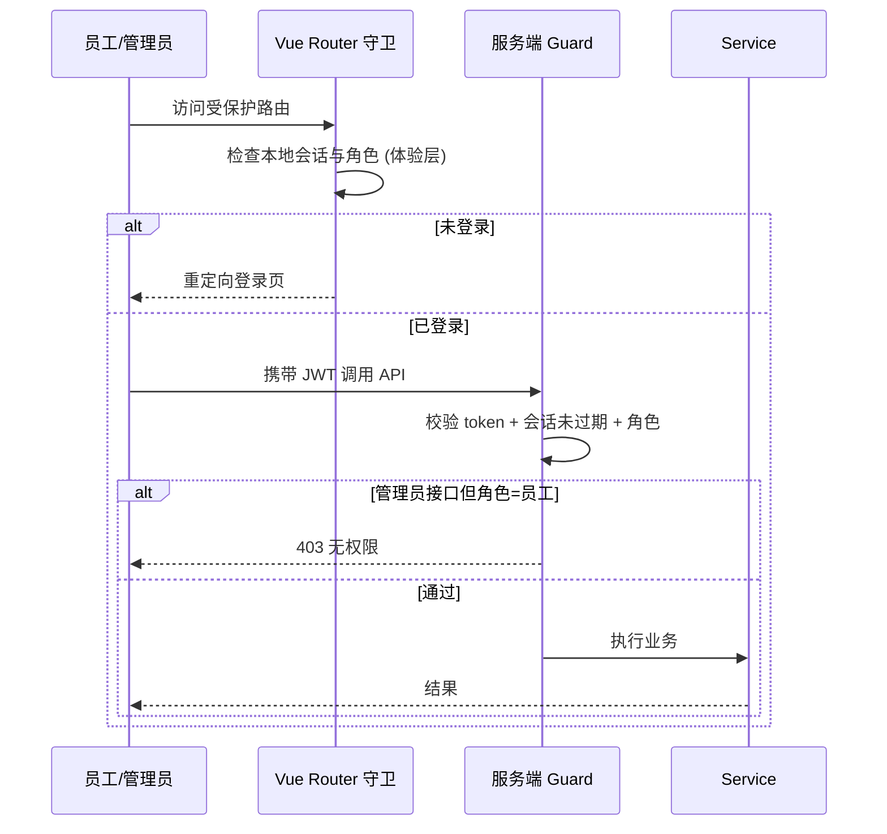
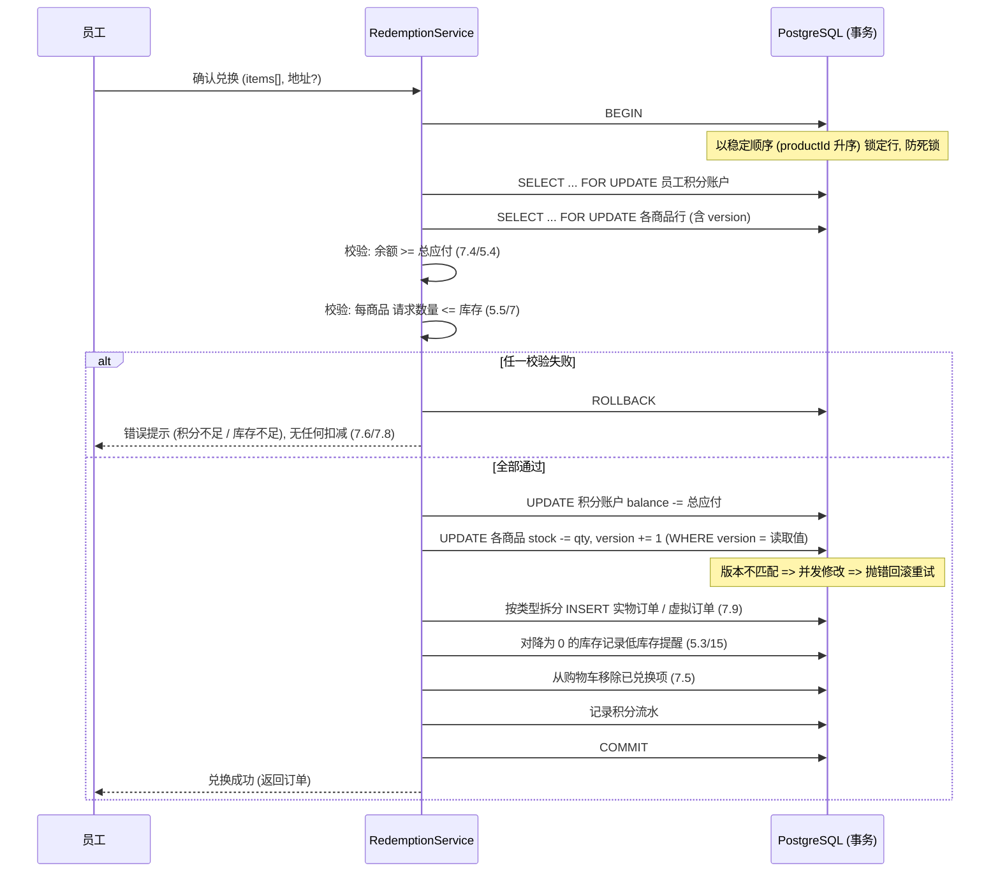
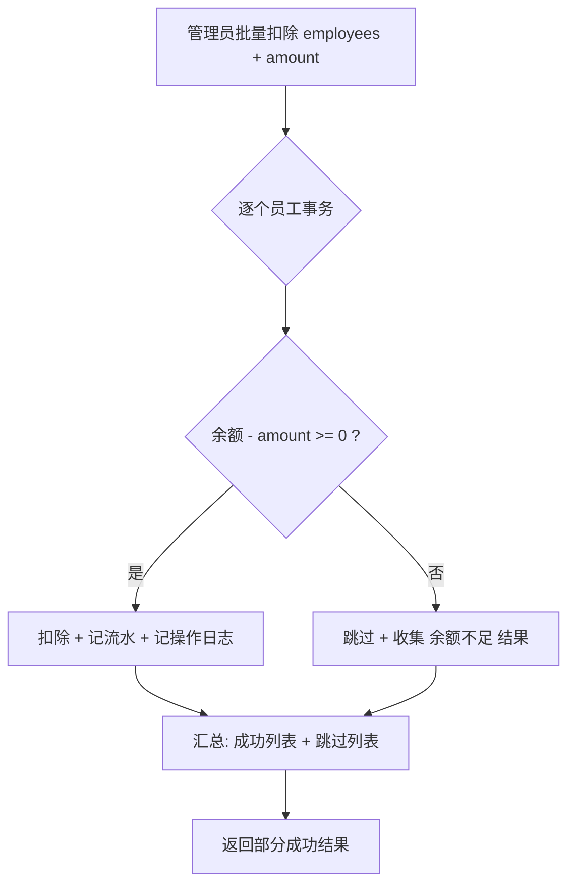
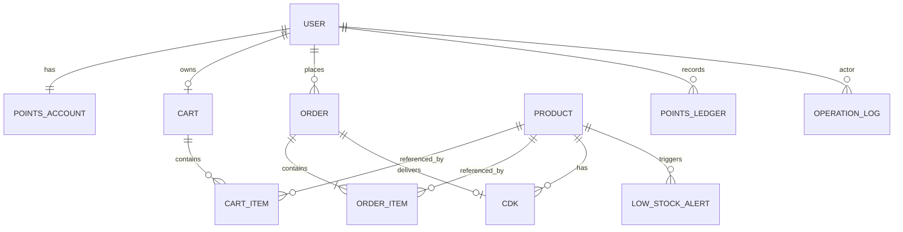

# Design Document

## Overview

AWSomeShop 是面向公司内部员工的福利积分兑换电商 MVP。本设计文档基于 `requirements.md` 中定义的 21 项需求，描述系统的整体架构、前后端组件、数据模型、正确性属性、错误处理与测试策略。

设计的核心难点集中在 **需求 7、需求 13、需求 19** 所要求的一致性保证：

- 兑换结算时，积分扣除与库存扣减必须**原子性**地整体成功或整体失败（需求 7.8）。
- 并发兑换同一商品时，库存不得**超卖**、积分不得**透支**（需求 7.10、19.2）。
- 员工积分余额**永不为负**（需求 10.3、13.3）。
- 批量扣分时对余额将变负的员工**跳过**，其余员工正常执行（**部分成功**，需求 13.4）。

这些属性天然适合属性化测试（Property-Based Testing, PBT），因为它们必须在**所有**输入组合与并发交错下成立，因此本文档包含 `Correctness Properties` 章节。

### 技术选型总览

设计尽量沿用现有技术栈（Vue 3 + TypeScript + Vite + Pinia + Vue Router + axios）。后端需求（需求 19.3 要求通过后端 API 与数据库持久化）使用与前端一致的 TypeScript 生态，降低团队认知成本。

| 层 | 选型 | 理由 |
|----|------|------|
| 前端框架 | Vue 3 (`<script setup>` + Composition API) + TypeScript | 现有项目已采用 |
| 前端构建 | Vite 6 | 现有项目已采用 |
| 前端状态 | Pinia | 现有依赖，用于会话、购物车、i18n 缓存 |
| 前端路由 | Vue Router 4 | 现有依赖，用于路由守卫做鉴权与角色控制 |
| HTTP 客户端 | axios（现有 `src/api/http.ts`） | 已配置拦截器与 401 处理 |
| 国际化 | vue-i18n | Vue 生态标准 i18n 方案（需求 17） |
| 后端运行时 | Node.js + TypeScript | 与前端同语言，共享类型定义 |
| 后端框架 | NestJS（或 Express，二者皆可） | 提供分层结构、依赖注入、Guard 便于角色鉴权（需求 3） |
| ORM | Prisma | 提供事务 API 与类型安全，便于实现原子扣减 |
| 数据库 | PostgreSQL | 支持事务、行级锁与 `SERIALIZABLE` 隔离级别，是满足原子性/防超卖的关键 |
| 认证 | JWT（access token）+ 服务端会话空闲过期跟踪 | 需求 1、2 |
| 测试 | Vitest + fast-check（PBT）；Supertest（API 集成） | fast-check 为 TS 生态成熟 PBT 库 |

> 说明：后端框架 NestJS/Express 的具体取舍不影响本设计的核心一致性方案；关键在于所有涉及积分与库存的写操作都封装在数据库事务内并使用适当的并发控制。

## Architecture

### 系统分层



### 认证与会话流程（需求 1、2、20）

- 登录成功后服务端签发 JWT（含 `userId`、`role`），前端存入 `localStorage`（沿用现有 `http.ts` 的 `token` 约定），每次请求经拦截器带上 `Authorization: Bearer`。
- **会话空闲过期（60 分钟）在服务端权威判定**：服务端为每个会话维护 `lastActiveAt`。每次受保护请求校验 `now - lastActiveAt <= 60min`；未过期则刷新 `lastActiveAt`，过期则返回 401 并要求重新登录。JWT 过期时间与该空闲窗口对齐，避免仅靠客户端计时（客户端计时不可信，需求 20.3）。
- 前端 `http.ts` 已对 401 做统一处理（清除 token 并跳转登录页），与需求 2.4 一致。
- 路由守卫在客户端做第一道防线（未登录/非管理员重定向），服务端 Guard 做权威校验（需求 3.3、3.4、20.4）——**权限判断以服务端为准**，客户端守卫仅用于体验。

### 角色与授权流程（需求 3、20）



### 兑换事务与并发控制流程（需求 7、19 — 核心）

兑换是系统中唯一需要跨"积分账户"与"多个商品库存"进行原子更新的操作。采用**单个数据库事务 + 行级锁（悲观）并辅以乐观锁版本号**的组合来同时满足原子性与防超卖：



并发控制说明：
- **事务隔离级别**使用 `SERIALIZABLE` 或 `REPEATABLE READ` + 行锁；库存 `UPDATE ... WHERE id=? AND version=?` 若影响行数为 0，说明存在并发修改，事务回滚并有限次重试。这在数据库层强制保证不超卖、不透支（需求 7.10、19.2）。
- 库存与积分的 `UPDATE` 使用**相对更新**（`stock = stock - qty`），且约束 `stock >= 0`、`balance >= 0`（数据库 `CHECK` 约束），构成最后一道防线（需求 10.3）。
- 锁的获取顺序固定（先积分账户、商品按 `productId` 升序），避免并发事务间死锁。

### 批量积分部分成功流程（需求 13.4）



每位员工的扣除各自成组（单员工原子），批量层面允许部分成功；每位**实际执行**扣除的员工各记录一条操作日志（需求 13.4、13.6）。

## Components and Interfaces

### 前端结构（在现有 `src/` 上扩展）

```
src/
  api/
    http.ts            // 现有 axios 实例
    auth.ts            // 注册/登录/登出/当前用户
    catalog.ts         // 商品列表/搜索/详情
    cart.ts            // 服务端购物车 CRUD
    redemption.ts      // 结算/立即兑换/订单历史
    admin.ts           // 商品管理/积分管理/发货/日志/低库存
  stores/
    auth.ts            // 会话/角色/token
    cart.ts            // 购物车镜像 + 合计
    catalog.ts         // 商品缓存与搜索状态
    i18n.ts            // 当前语言持久化
  router/
    index.ts           // 路由 + beforeEach 鉴权与角色守卫
  i18n/
    index.ts           // vue-i18n 配置
    locales/zh.ts      // 中文文案 (默认)
    locales/ja.ts      // 日文文案
  views/
    auth/LoginView.vue, RegisterView.vue
    shop/CatalogView.vue, ProductDetailView.vue, CartView.vue, CheckoutView.vue
    account/PointsView.vue, HistoryView.vue, OrderDetailView.vue
    admin/AdminProductsView.vue, AdminPointsView.vue, AdminFulfillmentView.vue,
          AdminLogsView.vue, AdminDashboardView.vue (低库存提醒)
  components/
    ProductCard.vue, ConfirmDialog.vue, AddressForm.vue, LanguageSwitcher.vue, ...
```

前端路由守卫（需求 1.9、2.4、3.1–3.3）：

```ts
// router/index.ts (示意)
router.beforeEach((to) => {
  const auth = useAuthStore()
  if (to.meta.requiresAuth && !auth.isAuthenticated) return { name: 'Login' }
  if (to.meta.requiresAdmin && auth.role !== 'admin') return { name: 'Catalog' } // 或 403 页
  return true
})
```

### 后端 API 契约

统一响应沿用现有 `ApiResponse<T>`（`{ code, message, data }`）与 `PaginatedData<T>`。所有 `/admin/*` 接口经管理员 Guard。所有非 `/auth/*` 接口经认证 + 会话空闲 Guard。

| 分组 | 方法 & 路径 | 说明 | 需求 |
|------|-------------|------|------|
| 认证 | `POST /auth/register` | 校验公司邮箱域名 + 密码强度，创建员工账号 | 1.1–1.6 |
| 认证 | `POST /auth/login` | 校验凭据，建立 60min 空闲会话，返回 token+role | 1.7, 1.8, 2.1 |
| 认证 | `POST /auth/logout` | 立即终止会话 | 2.5 |
| 认证 | `GET /auth/me` | 当前用户信息（刷新会话活跃时间） | 2.2 |
| 商品 | `GET /products` | 分页返回上架商品（含名称/图片/所需积分/库存状态） | 4.1, 4.2 |
| 商品 | `GET /products/search?q=` | 名称匹配的上架商品 | 4.3, 4.4 |
| 商品 | `GET /products/:id` | 商品详情（含类型） | 4.5 |
| 购物车 | `GET /cart` | 读取服务端购物车 | 6.5, 6.6 |
| 购物车 | `POST /cart/items` | 加入商品（校验上架+有货） | 6.1, 5.2 |
| 购物车 | `PATCH /cart/items/:productId` | 调整数量（校验不超库存） | 6.2, 6.3 |
| 购物车 | `DELETE /cart/items/:productId` | 移除条目 | 6.4 |
| 兑换 | `POST /redemptions/checkout` | 购物车结算（事务、可含地址） | 7.1, 7.3, 7.4, 7.8, 7.9 |
| 兑换 | `POST /redemptions/instant` | 立即兑换单件（事务） | 7.2, 7.4, 7.8 |
| 订单 | `GET /orders?page=` | 兑换历史（时间倒序、分页） | 11.1–11.4 |
| 订单 | `GET /orders/:id` | 订单详情（实物物流 / 虚拟 CDK 视状态展示） | 8.3, 9.3, 9.4 |
| 积分 | `GET /points/balance` | 当前余额 | 10.1–10.3 |
| 管理-商品 | `POST /admin/products` `PUT /admin/products/:id` | 创建/编辑商品，校验非负积分与库存 | 12.1–12.6 |
| 管理-商品 | `PATCH /admin/products/:id/status` | 上/下架 | 12.4, 4.2 |
| 管理-商品 | `POST /admin/products/:id/cdks` | 维护虚拟商品 CDK | 12.2, 5.1 |
| 管理-积分 | `POST /admin/points/adjust` | 单个发放/扣除（校验不透支） | 13.1, 13.3, 13.5, 13.6 |
| 管理-积分 | `POST /admin/points/batch-adjust` | 批量发放/扣除（部分成功） | 13.2, 13.4, 13.6 |
| 管理-发货 | `POST /admin/orders/:id/ship-physical` | 上传物流编号（非空校验） | 14.1, 14.3, 8.2 |
| 管理-发货 | `POST /admin/orders/:id/ship-virtual` | 关联 CDK 虚拟发货 | 14.2, 9.4 |
| 管理-提醒 | `GET /admin/alerts/low-stock` | 低库存提醒列表 | 15.1, 15.2 |
| 管理-日志 | `GET /admin/logs?page=` | 操作日志（时间倒序） | 16.1, 16.2 |

### 关键服务接口（后端，TypeScript 示意）

```ts
interface RedemptionService {
  // 结算/立即兑换共用核心，全程单事务
  checkout(userId: string, items: RedeemItem[], address?: Address): Promise<Order[]>
}

interface PointsService {
  adjust(adminId: string, userId: string, delta: number, reason?: string): Promise<PointsAccount>
  batchAdjust(adminId: string, userIds: string[], delta: number, reason?: string): Promise<BatchAdjustResult>
}

interface BatchAdjustResult {
  succeeded: Array<{ userId: string; newBalance: number }>
  skipped: Array<{ userId: string; reason: 'INSUFFICIENT_BALANCE' }>
}
```

## Data Models

### 实体关系



### 字段定义

**User（用户）**
| 字段 | 类型 | 约束 | 说明 |
|------|------|------|------|
| id | UUID | PK | |
| email | string | UNIQUE, 公司域名 | 需求 1.2, 1.4 |
| passwordHash | string | 非空 | 存储哈希，不存明文 |
| role | enum(`employee`,`admin`) | 默认 `employee` | 需求 1.3, 3 |
| createdAt | timestamp | | |

**Session（会话）**（或以 token 存储 + 服务端活跃表）
| 字段 | 类型 | 说明 |
|------|------|------|
| id | UUID | PK |
| userId | UUID | FK |
| lastActiveAt | timestamp | 空闲过期判定基准（需求 2.1–2.4） |
| expiresAt | timestamp | = lastActiveAt + 60min |
| revokedAt | timestamp? | 登出时置位（需求 2.5） |

**PointsAccount（积分账户）**
| 字段 | 类型 | 约束 | 说明 |
|------|------|------|------|
| userId | UUID | PK/FK | |
| balance | integer | `CHECK (balance >= 0)` | 永不为负（需求 10.3, 13.3） |
| version | integer | 乐观锁 | 并发防透支（需求 7.10） |

**Product（商品）**
| 字段 | 类型 | 约束 | 说明 |
|------|------|------|------|
| id | UUID | PK | |
| name | string | 非空、可搜索 | 需求 4.3 |
| imageUrl | string | | |
| description | text | | |
| pointsCost | integer | `CHECK (pointsCost >= 0)` | 需求 12.5 |
| type | enum(`physical`,`virtual`) | | 需求 12.1 |
| status | enum(`listed`,`unlisted`) | 默认 `unlisted` | 需求 4.1, 4.2, 12.4 |
| stock | integer | `CHECK (stock >= 0)`；虚拟商品为派生值 | 需求 5.1, 12.2 |
| version | integer | 乐观锁 | 防超卖（需求 7.10） |

> 虚拟商品的 `stock` 语义上等于其**未使用 CDK 数量**（需求 5.1、12.2）。实现上以 `SELECT COUNT(*) FROM cdk WHERE productId=? AND status='available'` 作为可兑换库存的权威来源；`Product.stock` 字段对虚拟商品可作缓存并在 CDK 变更时同步。

**CDK（虚拟兑换码）**
| 字段 | 类型 | 约束 | 说明 |
|------|------|------|------|
| id | UUID | PK | |
| productId | UUID | FK | |
| code | string | 加密/受控存储 | 待发货前不展示（需求 9.3） |
| status | enum(`available`,`consumed`,`delivered`) | | 消耗 1 个/次兑换（需求 9.2） |
| orderId | UUID? | FK | 关联到交付订单 |

**Cart / CartItem（服务端购物车，需求 6.6）**
| 字段 | 类型 | 说明 |
|------|------|------|
| Cart.id | UUID | PK |
| Cart.userId | UUID | UNIQUE FK |
| CartItem.cartId | UUID | FK |
| CartItem.productId | UUID | FK |
| CartItem.quantity | integer | `CHECK (quantity >= 1)` |

**Order / OrderItem（兑换订单，需求 7、8、9、11）**
| 字段 | 类型 | 说明 |
|------|------|------|
| Order.id | UUID | PK |
| Order.userId | UUID | FK |
| Order.type | enum(`physical`,`virtual`) | 按类型拆分（需求 7.9） |
| Order.pointsSpent | integer | 该订单消耗积分 |
| Order.status | enum(`pending_shipment`,`shipped`) | 待发货/已发货（需求 8.4, 9.3, 9.4, 14） |
| Order.shippingAddress | json? | 实物订单保存地址（需求 8.1） |
| Order.trackingNo | string? | 物流编号（需求 8.2, 14.1） |
| Order.createdAt | timestamp | 历史排序键（需求 11.2） |
| OrderItem.orderId | UUID | FK |
| OrderItem.productId | UUID | FK |
| OrderItem.productName | string | 下单时快照（历史稳定展示） |
| OrderItem.quantity | integer | |
| OrderItem.unitPoints | integer | 下单时快照单价 |

**PointsLedger（积分流水，需求 13.6, 20.2）**
| 字段 | 类型 | 说明 |
|------|------|------|
| id | UUID | PK |
| userId | UUID | FK |
| delta | integer | 正=发放/退回，负=兑换或扣除 |
| reason | enum(`redemption`,`admin_grant`,`admin_deduct`) + note? | 需求 13.5 |
| balanceAfter | integer | 审计用 |
| createdAt | timestamp | |

**OperationLog（操作日志，需求 16）**
| 字段 | 类型 | 说明 |
|------|------|------|
| id | UUID | PK |
| actorId | UUID | 操作人（需求 16.1） |
| action | enum(`product_create`,`product_update`,`product_status`,`points_grant`,`points_deduct`,`ship_physical`,`ship_virtual`) | 操作类型 |
| targetType / targetId | string / UUID | 操作对象 |
| createdAt | timestamp | 时间倒序展示（需求 16.2） |

**LowStockAlert（低库存提醒，需求 5.3, 15）**
| 字段 | 类型 | 说明 |
|------|------|------|
| id | UUID | PK |
| productId | UUID | UNIQUE（去重，避免重复触发，需求 15.1） |
| triggeredAt | timestamp | 库存降为 0 时生成 |
| resolvedAt | timestamp? | 补货/下架后清除 |

## Correctness Properties

*A property is a characteristic or behavior that should hold true across all valid executions of a system—essentially, a formal statement about what the system should do. Properties serve as the bridge between human-readable specifications and machine-verifiable correctness guarantees.*

以下属性由验收标准经 prework 分析归并去冗后得出。凡描述纯 UI 观感、平台兼容性、性能容量、架构约束的验收标准不在此列（改用示例/集成/冒烟/负载测试，见 Testing Strategy）。带有并发含义的属性（Property 15、16）通过对操作序列的线性化建模在内存模型 + 数据库集成两个层面验证。

### Property 1: 密码强度校验

*For any* 字符串 s, `validatePassword(s)` 返回通过当且仅当 s 长度 ≥ 8 且同时至少包含一个字母与一个数字。

**Validates: Requirements 1.1**

### Property 2: 公司邮箱域名校验

*For any* 邮箱字符串, 注册域名校验通过当且仅当其域名部分属于允许的公司邮箱域名集合。

**Validates: Requirements 1.2, 1.6**

### Property 3: 注册创建员工账号且拒绝重复邮箱

*For any* 使用公司域名且满足密码强度的注册输入, 若该邮箱尚未注册, 则成功创建且新账号角色为 `employee`; 若该邮箱已存在, 则注册被拒绝且用户集合不变。

**Validates: Requirements 1.3, 1.4**

### Property 4: 登录失败提示不可区分

*For any* 登录失败输入（无论邮箱不存在还是密码错误）, 系统返回的错误信息完全一致, 不泄露具体失败原因。

**Validates: Requirements 1.8**

### Property 5: 会话有效性不变式

*For any* 会话与任意当前时间 `now`, `isSessionValid(session, now)` 为真当且仅当该会话未被登出且 `now - lastActiveAt ≤ 60min`; 有效访问会刷新 `lastActiveAt`。

**Validates: Requirements 2.1, 2.2, 2.3, 2.5**

### Property 6: 未登录访问受保护资源被拒

*For any* 受保护接口/路由, 不携带有效会话的访问一律被拒绝（重定向或 401）。

**Validates: Requirements 1.9, 20.1, 20.3**

### Property 7: 基于角色的授权矩阵

*For any* （角色, 接口）组合, 管理端接口仅在角色为 `admin` 时放行, 员工端接口对已登录用户放行; 员工访问任一管理端接口一律被拒。

**Validates: Requirements 3.1, 3.2, 3.3, 3.4, 20.4**

### Property 8: 员工端列表与搜索仅含上架商品

*For any* 商品集合与任意搜索关键字（含空关键字表示浏览）, 返回结果恰为「状态为上架 且（无关键字或名称匹配关键字）」的商品子集, 绝不包含下架商品。

**Validates: Requirements 4.1, 4.2, 4.3, 12.4**

### Property 9: 商品展示字段完整

*For any* 商品, 列表项至少含名称、图片、所需积分与库存/可兑换状态; 详情至少含名称、图片、描述、所需积分、库存状态与类型（实物/虚拟）。

**Validates: Requirements 4.1, 4.5**

### Property 10: 虚拟商品可兑换库存等于可用 CDK 数

*For any* 虚拟商品与其 CDK 集合, 其可兑换库存等于状态为 `available` 的 CDK 数量; 当该数量为 0 时该商品视为「已兑完」。

**Validates: Requirements 5.1, 12.2**

### Property 11: 零库存商品不可加购或兑换

*For any* 库存为 0 的商品, 加入购物车与立即兑换均被拒绝。

**Validates: Requirements 5.2**

### Property 12: 购物车总额不变式与持久化往返

*For any* 购物车状态（经任意加入、改量、移除操作序列后）, 应付积分总额恒等于 Σ(单价 × 数量), 且每项小计 = 单价 × 数量; 将购物车写入服务端后于新会话读取应得到完全一致的内容。

**Validates: Requirements 6.1, 6.2, 6.4, 6.5, 6.6, 7.1**

### Property 13: 兑换前置校验阻止非法兑换且不产生副作用

*For any* 兑换请求, 若可用积分 < 应付总额, 或任一商品请求数量 > 其当前库存, 或含实物商品但未填写配送地址, 则兑换被拒绝, 且积分余额、所有商品库存、CDK 状态、订单集合均保持不变。

**Validates: Requirements 5.4, 5.5, 6.3, 7.3**

### Property 14: 兑换原子性（整体成功或整体失败）

*For any* 含一个或多个商品的兑换, 结果只有两种：要么全部生效（余额恰减少应付总额、每个商品库存恰减少对应数量、虚拟商品消耗对应数量 CDK、生成订单、来自购物车的已兑项被移除、积分流水被记录）, 要么全无变化（任何一处校验失败或异常时, 余额、所有库存、CDK 状态、订单集合与操作前完全一致, 不产生部分扣减）。

**Validates: Requirements 7.4, 7.5, 7.6, 7.8, 9.2**

### Property 15: 混合兑换按类型拆分且积分守恒

*For any* 同时包含实物与虚拟商品的兑换, 恰生成一个实物订单与一个虚拟订单, 每个订单项按其商品类型正确归类, 且两订单消耗积分之和等于本次兑换应付总额。

**Validates: Requirements 7.9**

### Property 16: 并发兑换不超卖、不透支

*For any* 针对同一商品/同一账户的并发兑换操作交错（任意线性化顺序）, 在所有操作完成后：每个商品的累计售出数量 ≤ 其初始库存（不超卖）, 每个账户的累计扣分 ≤ 其初始余额（不透支）, 且最终库存 ≥ 0、余额 ≥ 0。

**Validates: Requirements 7.10, 19.2**

### Property 17: 积分余额始终非负

*For any* 由兑换与管理员发放/扣除组成的任意操作序列, 每个员工的积分余额在每一步之后都 ≥ 0。

**Validates: Requirements 10.3, 13.3**

### Property 18: 积分变更仅经受控流程且余额=流水累积

*For any* 员工, 其当前余额恒等于初始余额加上其全部积分流水 delta 之和; 不存在任何可由客户端直接设定余额的通道。

**Validates: Requirements 10.2, 20.2**

### Property 19: 单个积分调整精确改变余额

*For any* 员工与调整量 delta, 若调整后余额 ≥ 0, 则调整后余额恰等于原余额 + delta。

**Validates: Requirements 13.1, 13.2**

### Property 20: 批量扣分部分成功分区与日志计数

*For any* 员工集合与扣除量, 批量扣除后 `succeeded` 恰为「扣除后余额 ≥ 0」的员工且其余额各减少该扣除量, `skipped` 恰为「扣除后余额将 < 0」的员工且其余额不变; `succeeded` 与 `skipped` 构成对输入集合的划分（不重不漏）, 且新增操作日志条数等于实际执行扣除的员工数。

**Validates: Requirements 13.4, 13.6**

### Property 21: 实物订单地址往返与发货状态转换

*For any* 含实物商品的兑换, 订单持久保存所填配送地址且读取一致; 未发货时状态为「待发货」, 上传非空物流编号后状态变为「已发货」并记录该编号。

**Validates: Requirements 8.1, 8.2, 8.4, 14.1**

### Property 22: 空物流编号被拒绝

*For any* 实物订单, 若提交的物流编号为空或纯空白, 则发货被拒绝且订单保持「待发货」。

**Validates: Requirements 14.3**

### Property 23: 虚拟发货前隐藏 CDK、发货后展示并置已发货

*For any* 虚拟订单, 在完成虚拟发货前其展示不含 CDK 且状态为「待发货」; 完成虚拟发货后状态变为「已发货」并展示已关联的 CDK。

**Validates: Requirements 9.3, 9.4, 14.2**

### Property 24: 纯虚拟兑换不要求地址

*For any* 仅包含虚拟商品的兑换, 无需填写配送地址即可成功。

**Validates: Requirements 9.1**

### Property 25: 低库存提醒在库存降为 0 时唯一触发（去重）

*For any* 使某商品库存降为 0 的兑换序列, 该商品当前有且仅有一条未解决的低库存提醒, 不因重复降为 0 而产生重复提醒。

**Validates: Requirements 5.3, 15.1**

### Property 26: 兑换历史字段完整、时间倒序与分页完整

*For any* 员工的订单集合, 历史列表每项至少含商品名称、消耗积分、兑换时间与状态, 结果按兑换时间从新到旧排序; 且对任意分页参数, 各页记录拼接后恰等于全集（无重复、无遗漏）, 每页大小不超过页容量。

**Validates: Requirements 11.1, 11.2, 11.3**

### Property 27: 操作日志完整性与时间倒序

*For any* 受审计操作（商品增改/上下架、积分发放/扣除、实物/虚拟发货）, 系统恰生成一条含操作人、操作类型、操作对象与操作时间的日志; 日志列表按时间从新到旧排序。

**Validates: Requirements 16.1, 16.2, 14.4**

### Property 28: 商品创建/编辑往返一致

*For any* 合法商品输入, 创建或编辑保存后读取应得到与输入一致的字段, 并对员工端后续浏览生效。

**Validates: Requirements 12.1, 12.3**

### Property 29: 非法商品数值被拒绝

*For any* 商品输入, 若所需积分或库存为负数或非法值, 则保存被拒绝且不产生/修改商品。

**Validates: Requirements 12.5**

### Property 30: i18n 文案键完整对齐且切换取对应语言

*For any* 面向用户的文案键, 中文与日文文案集合的键完全一致且均无空值; 切换语言后, 每个键渲染出所选语言对应的文案。

**Validates: Requirements 17.2, 17.3**

## Error Handling

### 错误响应约定

沿用现有 `ApiResponse<T>` 结构，错误以非零 `code` + 可本地化 `message` 返回。前端根据 `code` 映射到 i18n 文案（需求 17），保证中日双语错误提示完整。

| 场景 | HTTP | code 分类 | 前端处理 | 需求 |
|------|------|-----------|----------|------|
| 未认证 / 会话过期 | 401 | `UNAUTHENTICATED` | `http.ts` 清 token 并跳登录页 | 1.9, 2.4, 20.1, 20.3 |
| 无管理员权限 | 403 | `FORBIDDEN` | 提示无权限 / 跳转 | 3.3, 20.4 |
| 注册校验失败 | 422 | `VALIDATION`（逐项 field errors） | 表单逐项高亮 | 1.5, 1.6 |
| 邮箱已注册 | 409 | `EMAIL_TAKEN` | 表单提示 | 1.4 |
| 积分不足 | 409 | `INSUFFICIENT_POINTS` | 兑换弹窗提示 | 5.4, 7.4 |
| 库存不足 / 超卖冲突 | 409 | `INSUFFICIENT_STOCK` | 提示并刷新库存 | 5.5, 6.3, 7.10 |
| 并发版本冲突 | 409 | `CONCURRENCY_CONFLICT` | 后端有限重试; 耗尽则提示重试 | 7.10, 19.2 |
| 缺少配送地址 | 422 | `ADDRESS_REQUIRED` | 结算前拦截 | 7.3 |
| 空物流编号 | 422 | `TRACKING_REQUIRED` | 管理端表单提示 | 14.3 |
| 批量扣分部分失败 | 200 | 结果体含 `skipped[]` | 展示成功/跳过明细 | 13.4 |
| 非法商品数值 | 422 | `INVALID_PRODUCT_FIELD` | 表单提示 | 12.5 |

### 事务与并发错误策略

- 兑换事务遇 `CHECK` 约束违反（`balance/stock < 0`）或乐观锁版本不匹配时，整事务 `ROLLBACK`，对外表现为 `INSUFFICIENT_STOCK` / `INSUFFICIENT_POINTS` / `CONCURRENCY_CONFLICT`，绝不落地部分变更（保证 Property 14）。
- 版本冲突采用**有限次自动重试**（如最多 3 次，带抖动）；重试仍失败则返回 `CONCURRENCY_CONFLICT` 让用户重试。
- 批量积分操作中单个员工的失败被捕获并归入 `skipped[]`，不影响其余员工（保证 Property 20）。

### 前端错误边界

- axios 响应拦截器统一处理 401（已实现）；其余错误由各 Pinia action 捕获并转为可展示的本地化消息。
- 视图层对空态（无搜索结果、无历史记录）展示友好空状态（需求 4.4、11.4）。

## Testing Strategy

采用**属性化测试 + 单元测试 + 集成测试**互补的分层策略。

### 属性化测试（Property-Based Testing）

- **库**：`fast-check`（与 Vitest 集成），不自建 PBT 框架。
- **迭代次数**：每个属性测试至少运行 **100** 次随机迭代（`fc.assert(prop, { numRuns: 100 })`）。
- **标签**：每个属性测试以注释标注来源，格式：`// Feature: awsome-shop, Property {number}: {property_text}`。
- **一对一**：上述每条 Correctness Property 由**单个**属性测试实现。
- **并发属性（Property 16）建模**：以「操作序列 + 线性化」的模型化测试验证纯逻辑层不变式（内存 reducer 模型），并辅以针对真实 PostgreSQL 事务的集成测试并行发起竞争请求，断言最终库存/余额不变式成立。
- **生成器覆盖边界**：邮箱生成器覆盖公司/非公司域名、大小写、非法格式；密码生成器覆盖长度与字符类边界；商品生成器覆盖实物/虚拟、上/下架、零库存；金额/库存生成器覆盖 0、负数与大值；Unicode 文案覆盖中日文与特殊字符。

### 单元测试

聚焦具体示例、缺省行为与不易属性化的点：
- 登录成功跳转、二次确认弹窗（7.1、7.2）、成功兑换不可取消（7.7）、可选备注（13.5）、实物不强制 CDK（12.6）。
- 空状态展示（4.4、11.4）、默认语言中文（17.1）、低库存提醒后台展示（15.2）、已发货实物订单展示物流（8.3）。
- 边界/错误条件：非法注册输入逐项报错（1.5）、过期会话 401（2.4）、下架不可兑（12.4）。

### 集成测试（Supertest + 测试数据库）

不适合 PBT 的基础设施/持久化验证：
- 数据变更经后端 API 落库（19.3）：写入后重启读取仍存在。
- 端到端兑换事务在真实数据库上的原子性与并发防超卖（7.10、19.2）——1~3 个代表性并发场景 + Property 16 的模型层覆盖。
- 权限 Guard 在真实路由上的拦截（3、20.4）。

### 非 PBT 覆盖说明

- 平台兼容性（18.1、18.2）与界面风格（21.1）：手工 / E2E 冒烟评审，不做属性化。
- 性能与容量（19.1）：负载 / 压力测试，不做属性化。

### 覆盖矩阵摘要

| 需求 | 主要验证方式 |
|------|--------------|
| 1, 2, 3, 20（认证/会话/授权） | Property 1–7 + 单元(1.5,2.4) + 集成(Guard) |
| 4, 5, 12（商品/库存/管理） | Property 8–11, 25, 28, 29 + 单元(4.4,12.4,12.6) |
| 6, 7, 9, 19.2（购物车/兑换/并发） | Property 12–17, 24 + 集成(并发) + 单元(7.1,7.2,7.7) |
| 8, 14（发货） | Property 21–23, 27 + 单元(8.3) |
| 10, 11, 13, 16（余额/历史/积分/日志） | Property 17–20, 26, 27 + 单元(13.5) |
| 15（低库存提醒） | Property 25 + 单元(15.2) |
| 17（i18n） | Property 30 + 单元(17.1) |
| 18, 19.1, 21（平台/性能/风格） | 冒烟 / 负载 / 人工评审 |
